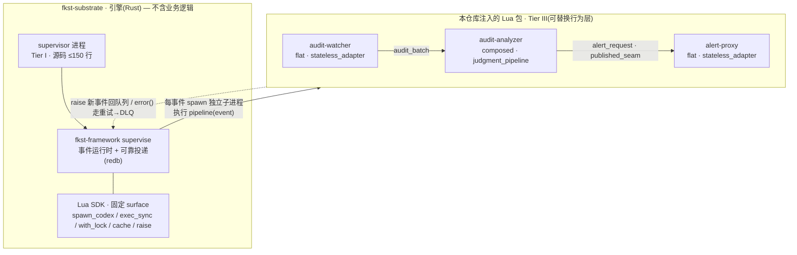
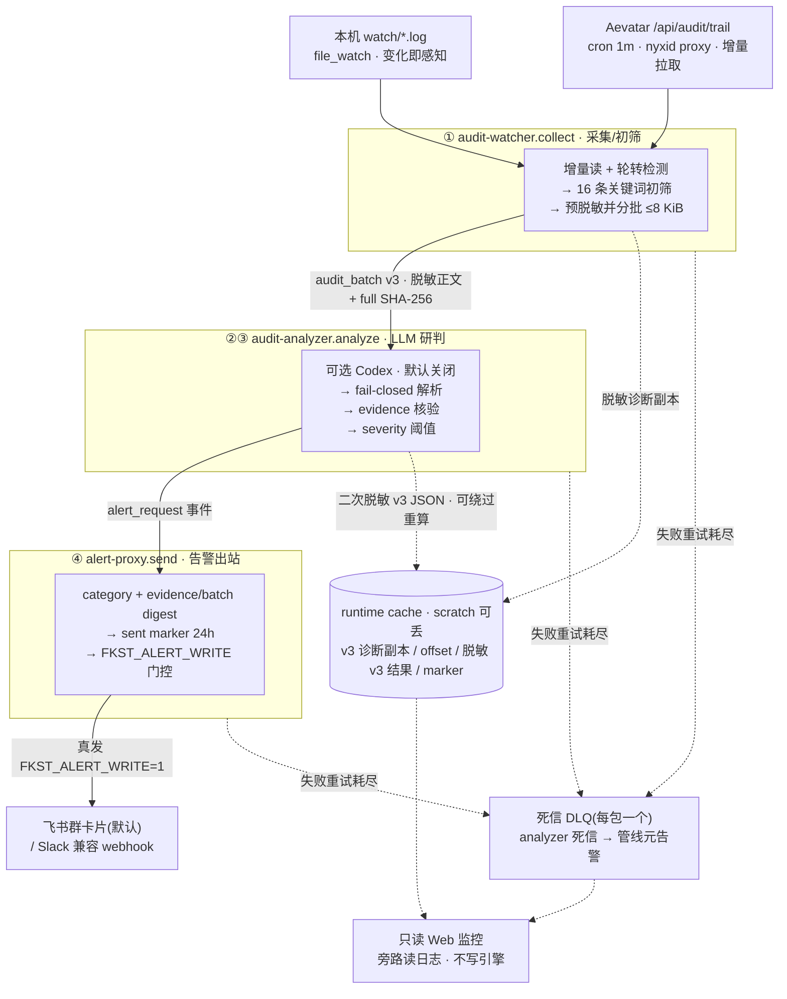
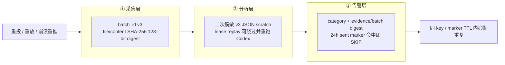
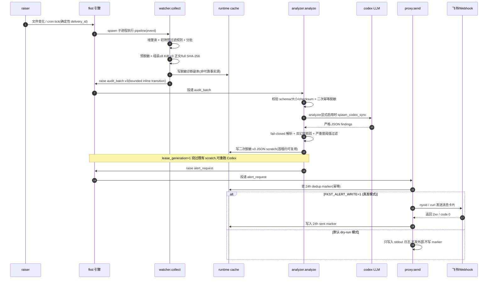

# fkst-audit-log

用 [fkst](https://github.com/ChronoAIProject/fkst-substrate)(一个受监督的事件驱动运行时)搭建的审计日志安全监控管线:**监听审计日志 → LLM 语义分析 → 反幻觉核验 → 有界去重告警**。同时覆盖本机 `watch/*.log` 与 **Aevatar `/api/audit/trail`**(经 NyxID),并把持续不稳定闭环为 **Aevatar Issue → 官方 github-devloop + consensus → 修复 PR**。

> 本 README 已整合原《设计汇报文档》(2026-07-09)全文(「一」至「五」章及附录)。配套技术底稿:[fkst-工作流程分析报告.md](fkst-工作流程分析报告.md)、[audit-log-llm-监控告警方案.md](audit-log-llm-监控告警方案.md)。业务层技术论断均可回溯到本仓库源码(给出 `文件:行` 引用);涉及 fkst 引擎内部的论断(子进程 permit 池、资源类枚举、file_watch 轮询周期等)以配套的工作流程分析报告为准,不在本仓库源码内。

---

## 摘要(一页纸结论)

我们用 **fkst** 搭了一条完整的审计日志安全监控管线:**监听审计日志 → LLM 语义分析 → 反幻觉核验 → 有界去重告警**,并在其上叠加了第二条自动化闭环:**规则化不稳定检测 → 自动提 GitHub Issue → 官方 consensus devloop 修复**(见「稳定性检测与自动提 Issue」一节)。

三个核心问题的答案:

1. **如何融合 fkst**:把管线四环节映射成 5 个 fkst 包([audit-watcher](packages/audit-watcher/) / [audit-analyzer](packages/audit-analyzer/) / [alert-proxy](packages/alert-proxy/) / [stability-sentinel](packages/stability-sentinel/) / [issue-proxy](packages/issue-proxy/)),完整复用引擎的**可靠投递、崩溃即重启、并发限流的 LLM 子进程、死信队列、conformance 门禁、dry-run 姿态**,并逐条照抄 fkst 官方包(`archaudit`、`github-proxy`)验证过的设计模式。我们没有绕过引擎的任何安全边界,而是站在它的能力面上。
2. **如何借鉴开源安全项目**:先做了 **43 个开源项目的联网调研**,得出"通行做法是分层降噪、结构化输出、送云前脱敏、告警去重"的共识,然后把这些共识**落到 fkst 的工程骨架上**——用严格 JSON schema + fail-closed 解析(对标 LogSentinelAI 的 Pydantic Schema)、本地日志关键词与 Aevatar outcome/action 双轨初筛(对标 Wazuh 规则 / Drain3 聚类)、反幻觉证据核验、内容派生去重。fkst 提供的正是这些项目普遍薄弱的部分:可靠投递、幂等、DLQ、dry-run。
3. **能达到什么目标**:一套**崩溃可恢复、幂等去重、上线前可空跑验证**的安全监控**工程骨架**。降噪与误报控制的**机制**(双轨初筛、反幻觉核验、severity 阈值、内容派生去重)已实现并单测覆盖;真实 Codex/Aevatar batch 冒烟已经跑通,但**检出率与误报率尚未在标注数据上实测**。

**当前状态(务必分清三件事):**

- **工程底盘:已建成并验证** —— 5 个生产包的 Lua 回归、Web 回归与 conformance 均有自动化门禁;最终合并态的测试数字以本次收口实跑结果为准。旧的自制 issue watcher/solver 已退出 active graph。
- **检出价值:真机链路已通,阈值待校准** —— 本机 `codex` 已在真实 Aevatar batch 上成功运行;但检出率与误报率仍需用标注过的历史日志量化,不能仅凭链路跑通下结论。
- **自动修复:真写决策链已实测,PR 取决于证据可行动性** —— 审计侧已真实创建 Aevatar issue,官方 github-devloop 完成认领与两轮 consensus；样本因源审计记录缺少 `errorCode/stage/httpStatus/owner` 而 fail-closed 转为 blocked,未创建错误归因的 PR。可行动 issue 的 implementation → PR 仍由同一 host 执行并受全量 Aevatar 测试/架构门禁约束。

---

## 五问速答(FAQ)

### Q1:数据是从哪里来的?

两个数据源,都汇入 `audit-watcher` 包的 collect 部门(详见 §4.2.1):

- **源 A · 本机文件日志**:仓库根的 `watch/*.log`(改 [log_watch.lua](packages/audit-watcher/raisers/log_watch.lua) 可换成系统路径,如 `/var/log/audit/*.log`)。由 **file_watch raiser** 实时监听文件大小与修改时间变化(5s 内感知)抛出 `audit_file_changed` 事件;另有每 10 分钟一次的 **cron sweep**([sweep_poll.lua](packages/audit-watcher/raisers/sweep_poll.lua))全量扫描兜底。读取时按 cache 里的 offset + 内容指纹 `v2:<size>:<完整 SHA-256>` 做**增量读**,指纹不符判定文件轮转、从头重读。runtime `file_key` 另用路径 SHA-256 的 128-bit(32 hex)前缀避免清洗碰撞。
- **源 B · Aevatar 云审计流**:Aevatar 平台的 `/api/audit/trail`(默认端点 `https://aevatar-console-backend-api.aevatar.ai`)。由每分钟一次的 **cron raiser**([aevatar_audit_poll.lua](packages/audit-watcher/raisers/aevatar_audit_poll.lua))触发,collect 通过 `exec_sync` 执行 **`nyxid proxy request aevatar /api/audit/trail`** 拉取([collect/main.lua](packages/audit-watcher/departments/collect/main.lua))——凭据由 NyxID 代理,本项目不接触原始密钥。每轮建立一个 newest-first 的固定 `from/to` 查询窗口;cursor 跨 tick 沿较旧页面续读且始终复用同一组边界与过滤条件,耗尽后才用服务端 query watermark 推进下一轮。初始 `from` 默认回看 2 小时,每条 audit id 另走 seen 缓存去重(7 天 TTL)。需要 `AEVATAR_AUDIT_ENABLED=1` 才启用。

### Q2:LLM 是什么时机介入的?

**不是每条日志都进 LLM**。介入点在"第一道闸"初筛之后、以事件为界(详见 §4.2.2、§4.8.1):

1. 采集端先初筛:本地日志行须命中 16 条关键词 pattern 之一([core.lua:194-202](packages/audit-watcher/core.lua));Aevatar 记录须 outcome 异常 / action 以 `.failed` 等结尾 / 属于成功的高影响治理变更(`*.attempted` 跳过,[core.lua:344-384](packages/audit-watcher/core.lua))。未命中的行直接丢弃,永远不见 LLM。
2. 通过初筛的行按 **≤8 KiB** 拼批,watcher 先用共享规则脱敏,再发布 `audit-watcher.batch.v3`。payload 带 `content_schema="audit-redaction.v1"`、脱敏 `content` 与完整 64-hex SHA-256 `content_checksum`;`batch_id` 内部修订同为 v3,文件/正文身份使用 SHA-256 的 128-bit 前缀。runtime cache 中的同内容副本只供本地诊断([collect/main.lua](packages/audit-watcher/departments/collect/main.lua))。
3. `audit-analyzer` 校验 v3 的正文 schema、非空字符串、8 KiB 上限和完整 SHA-256 后再幂等脱敏。滚动兼容分两层:`batch.v2` 仍是 inline,checksum 可为旧十进制 DJB2 或过渡期 SHA-256;`batch.v1` 才回源旧 cache,miss 会显式进入 retry/DLQ。analyzer 默认关闭;启用后会把通过 evidence 门禁的 finding 再脱敏,只把 `redacted-v3-sanitized-output` JSON 放入 24h scratch cache。可靠重投在 `lease_generation>1` 时会绕过既有 scratch 读取,所以可能再次调用 Codex,不能承诺重放不重算([analyze/main.lua](packages/audit-analyzer/departments/analyze/main.lua))。

### Q3:怎么调用的 LLM?

用 fkst 引擎的一等原语 **`spawn_codex_sync`**:同步拉起 host 上的 `codex` CLI 子进程(需已安装并登录),引擎侧自带并发 permit 池、超时 SIGKILL、审计留痕、错误归类。该可选告警支路默认关闭,只有 `AUDIT_ANALYZER_CODEX_ENABLED=1` 才启用;它不参与确定性的 stability → issue → devloop 主路径。调用点在 [analyze/main.lua](packages/audit-analyzer/departments/analyze/main.lua):

```lua
local analysis_lines = core.redact_log_lines(batch_lines)
local result = spawn_codex_sync({
  prompt = core.build_prompt(analysis_lines, core.max_findings()),
  sandbox = "read-only",
  timeout = codex_timeout_seconds, -- 默认 10 分钟
})
```

这里的 `read-only` 只限制 Codex 写入和命令网络访问,**仍允许读取宿主进程本来可读的文件**。更关键的是,当前引擎会把 `spawn_codex_sync` 的 stdout 原样写入 Codex process-trace log,本仓库没有关闭这次记录的开关;package 只能确保自己的结果 cache 保存二次脱敏后的 JSON。因此启用前必须用额外 OS/container sandbox 收窄 supervisor/Codex 的可读文件面,否则应保持开关为 `0`。

失败路径:exit 124 归类 `codex-timeout`、其他非零归类 `codex-nonzero`,抛 `error()` 交给引擎做指数退避重试(analyze 部门 `max_attempts=3`),耗尽进死信([analyze/main.lua:44-50](packages/audit-analyzer/departments/analyze/main.lua))。stdout 必须是严格 JSON 数组,进 fail-closed 解析(见 Q4/§4.8.2)。

> 诚实边界:本机已用真实 `codex` 成功分析 Aevatar batch,但模型结论没有持久化为 explicit host fact;它只是可重算的可选 judgment。故 LLM 告警支路不是端到端 critical reliable path,也不影响纯规则稳定性闭环。

### Q4:给 LLM 的提示词是什么?

由 [core.lua:60-89 build_prompt](packages/audit-analyzer/core.lua) 生成(`<limit>` 处注入 finding 上限,默认 5),全文:

```text
You are a security analyst reviewing pre-filtered audit log lines.
Analyze ONLY the log lines between the LOG LINES markers below.
Input can contain host logs or structured lines beginning with 'aevatar event'.
Identify genuine anomalies: privilege escalation, brute-force or unusual
authentication failures, suspicious process or file access, persistence
attempts, data exfiltration, failed/rejected platform operations, or an
unusual sequence of high-impact governance changes (policy, identity/service
binding, credentials/keys, deletion/revocation, deployment, or publishing).
For Aevatar projection facts, outcome=Success means the audit artifact was
materialized successfully; an action ending in .failed or .rejected still
describes a failed domain operation and must be interpreted from its action.
A single successful high-impact mutation is not anomalous by itself. Report it
only when the supplied lines contain concrete evidence of unexpected behavior,
dangerous blast radius, repetition, or a failure/denial; never assume that the
hashed actor was unauthorized from the action name alone.
Do not invent events that are not present in the lines.
Do not report routine, benign operations.
Return strict JSON only: an array of at most <limit> objects, no prose.
Object schema: {"severity":"critical|high|medium|low","category":"short-slug",
  "evidence_line":"<one exact line copied verbatim from the input>",
  "why":"...","recommended_action":"..."}
Return [] when nothing is anomalous.

=== LOG LINES START ===
<log_lines>
=== LOG LINES END ===
```

要点:只许分析标记之间的行;列举要找的异常类型;解释 Aevatar `outcome=Success` 的投影语义;"单次成功的高影响变更本身不算异常";禁止编造、禁止报告良性日常操作;只准返回严格 JSON 数组(≤5 个 finding、schema 固定),无异常返回 `[]`。

### Q5:怎么告警?

四步,末端由 `alert-proxy` 统一出站(详见 §4.8.3):

1. **analyzer 侧过滤**:finding 先过反幻觉核验(`evidence_line` 必须逐字出现在实际投喂模型的同一份脱敏批次,否则丢弃),再过 severity 阈值(`AUDIT_ALERT_MIN_SEVERITY`,默认 `high`),达标才 raise `alert-proxy.alert_request`,携带 `dedup_key = 类别 + 证据行 SHA-256 128-bit 摘要 + batch_id SHA-256 128-bit 摘要`;key 中没有天桶。
2. **去重**:`alert-proxy.send` 在 `with_lock` 串行区内查 sent marker;同一 dedup key 在成功发送后的 24h marker TTL 内命中即 SKIP,防止同一批次告警重复外发([send/main.lua](packages/alert-proxy/departments/send/main.lua))。
3. **门控**:`FKST_ALERT_WRITE` 不为 `1` 时 dry-run——只打 `OUTBOUND mode=dry-run` 日志、不外发、**不写 sent marker**(之后开开关仍会补发);为 `1` 才真发([send/main.lua:112-117](packages/alert-proxy/departments/send/main.lua))。
4. **通道**:默认 **lark 模式**——`nyxid proxy request` 调飞书 `open-apis/im/v1/messages` 发交互式卡片(service 默认 `api-lark-bot`,目标群由 `ALERT_LARK_CHAT_ID` 指定)。卡片为中文人话版:标题 `🚨 审计告警 · 高危 · <category>`,正文按"发生了什么 / 建议处理 / 证据日志(代码块)"分块,source_path/batch_id/dedup_key 收进灰色脚注,schema 字段不展示;头色按级别区分 critical 红、high 橙、medium 黄、low 灰([send/main.lua:60-93](packages/alert-proxy/departments/send/main.lua)、[core.lua](packages/alert-proxy/core.lua) `render_lark_card_content`);LLM 产出的 summary/action 由 analyzer 提示词约束为简体中文([audit-analyzer/core.lua](packages/audit-analyzer/core.lua) `build_prompt`);**webhook 模式**——host `curl` POST Slack 兼容 `{"text": …}` 到 `ALERT_WEBHOOK_URL`,critical 优先走 `ALERT_WEBHOOK_URL_CRITICAL` 独立通道([send/main.lua:30-58](packages/alert-proxy/departments/send/main.lua))。

发送失败抛 `error()`,引擎做 5 次指数退避重投([send/main.lua:12](packages/alert-proxy/departments/send/main.lua)),耗尽进 `dead_letter`,死信部门用独立的 `ALERT_FALLBACK_WEBHOOK_URL` 备用通道发紧急元告警。analyzer 自身持续失败(如 Codex 调用持续报错)的死信也会升级为一条 `pipeline-dead-letter` 元告警(见 §4.5)。

### Q6:怎么发现"系统不稳定"、提 issue 并自动修复?

告警管线之外的第二条闭环,纯规则、无 LLM 决策(详见「稳定性检测与自动提 Issue」一节):

1. **检测**:`stability-sentinel.detect` 每 5 分钟从 `aevatar-events.jsonl` 全量快照(含成功记录,有分母可算错误率)+ 引擎死信日志重算 4 类信号——持续失败 / 错误率飙升 / 状态震荡(flapping) / 管线死信复发,按 30 分钟桶做窗口数学,快照没覆盖到的桶一律算"数据不足"而非"安静"。
2. **滞回**:信号首次命中只进 candidate,连续两个 tick 才 open(一次抖动永不提单);恢复要求最新桶零失败且连续 6 个安静桶(3h)才 close——开严关更严,悬在阈值边缘不会让 issue 反复开关。
3. **提单**:`issue-proxy.file` 收到 open/comment/close 事件后:先过 fail-closed 校验和**通用脱敏**(敏感 key=value、Bearer、URL 凭据、长 hex、JWT,身份类字段截断到前 8 位),再查 GitHub 本身(`gh issue list` 搜标题里的 `fp:<指纹>`)——GitHub 是唯一能扛住缓存清空/重启的去重索引;带 `fkst-mute`/`wontfix` 标签关闭的 issue 永久压制该指纹。新 issue 创建成功后还会进入 durable 通知 outbox,向现有告警通道发送 `issue-filed` 提醒;只有 alert-proxy 确认真实投递后回 ACK 才清除,崩溃或 Lark 失败会在 5 分钟 tick 中继续补发。
4. **姿态**:`FKST_ISSUE_WRITE=1` 才真写;dry-run 请求进入有界 pending 索引,翻开关后每 5 分钟回放。Aevatar 与管线死信分别路由到 `FKST_AEVATAR_ISSUE_REPO` / `FKST_PIPELINE_ISSUE_REPO`,默认每天各最多 1 个新 issue。提单提醒复用 `FKST_ALERT_WRITE` 和同一个 Lark 群;alert dry-run 不产生 ACK,因此 outbox 会保留到真实告警打开后补发。
5. **修复**:Aevatar issue 自动带 `fkst-dev:enabled`;独立的干净 Aevatar host 运行同步后的官方 `github-devloop + consensus`。它只认本机 bot 自己创建且未被他人认领的 issue,先 consensus 收敛,再实现、验证并开 PR。普通恢复 `kind=close` 仍不得关闭 `fkst-dev:*` issue；另一个默认关闭的 5 分钟 reconciler 仅在 `FKST_ISSUE_CLOSE_ON_DROP=1` 且可信的 plain `reconcile:v1 action=drop` 成为当前 blocked 状态时,把该审计 issue 关闭为 `not planned`。

---

## 快速开始

```sh
# 1. 引擎二进制(兄弟目录的 fkst-substrate)
cd ../fkst-substrate && cargo build -p fkst-framework && cd -

# 2. 本地配置
cp .fkst/env.example .fkst/env
chmod 600 .fkst/env
$EDITOR .fkst/env   # Lark 模式设 ALERT_LARK_CHAT_ID;或配置 webhook 模式

# 3. 统一验证(shell/launcher + conformance/Lua + Web test/build)
scripts/check.sh

# 4. 启动审计服务和看板(默认 dry-run 姿态)
./boot.sh

# 5. 配置、初始化并预检官方 Aevatar devloop（不写 GitHub）
cp .fkst/aevatar-devloop.env.example .fkst/aevatar-devloop.env
chmod 600 .fkst/aevatar-devloop.env
$EDITOR .fkst/aevatar-devloop.env
scripts/aevatar-devloop.sh init
scripts/aevatar-devloop.sh preflight
```

审计告警与 issue、官方 devloop 各有独立真写开关。先让 `preflight` 通过,再分别在两个忽略入库的 profile 中开启;不要把 Aevatar 的 dirty 开发工作区用作 devloop host。

`start` 默认以前台 dry-run 姿态运行,当前终端会由官方 supervisor 持续占用;另开一个终端可查看状态或停止:

```sh
scripts/aevatar-devloop.sh start    # dry-run:允许只读轮询,不认领、不评论、不创建 PR
scripts/aevatar-devloop.sh status   # 显示本次启动时持久化的 real/dry-run 姿态
scripts/aevatar-devloop.sh stop
```

GitHub 真写使用双重门控:本机 `.fkst/aevatar-devloop.env` 必须设置 `FKST_GITHUB_WRITE=1`,同时启动命令必须显式传 `start --write`;只满足前者时仍按 dry-run 启动,只传后者则拒绝启动。需要脱离终端运行时,先用 dry-run 验证下面的后台方式:

```sh
log_dir="$HOME/.local/state/fkst-audit-log/aevatar-devloop"
mkdir -p "$log_dir" && chmod 700 "$log_dir"
umask 077
nohup scripts/aevatar-devloop.sh start >"$log_dir/launcher.log" 2>&1 < /dev/null &
```

确认 `status`、日志与待处理 issue 范围都正确后,真写启动使用 `scripts/aevatar-devloop.sh start --write`。`start --restart` 会先在当前 checkout 上完成同步性、身份、conformance 和 runtime smoke 门禁；任一失败都保留原 supervisor。若 platform 落后,它不会在线 pull 活跃 source,而是要求显式 stop/prepare。`status` 和 `stop` 只加载受权限保护的 profile 以及进程识别所需路径,即使 Python、Codex、dotnet 或 GitHub 登录暂时不可用也能执行。

LLM 分析通过 [codex CLI](https://github.com/openai/codex)(`spawn_codex_sync`)执行,需要 host 上 `codex` 可用且已登录。

## 架构速览

```text
watch/*.log 变化(file_watch raiser,5s 内感知;另有 10m cron 兜底扫描)
  → audit-watcher.collect     增量读文件(offset 缓存)、关键词初筛、预脱敏、分批(≤8 KiB)

可选:Aevatar /api/audit/trail(1m cron,通过 nyxid proxy request 拉取)
  → audit-watcher.collect     cursor/watermark 增量拉取、audit id 去重、outcome/action 风险初筛、分批

  →   audit_batch v3 事件      bounded inline payload 带脱敏正文 + schema/SHA-256;cache 仅诊断副本
  → audit-analyzer.analyze    可选且默认关闭;校验正文 → 二次幂等脱敏 → Codex → evidence/阈值门禁
  →   alert-proxy.alert_request
  → alert-proxy.send          category+evidence/batch digest → sent marker 24h → 飞书 / webhook
                              默认 dry-run;FKST_ALERT_WRITE=1 才真发
死信:每包 dead_letter 部门;analyzer 的死信升级为管线元告警;
      alert-proxy 的死信走独立 fallback webhook。

第二条闭环(稳定性 → GitHub Issue):
aevatar-events.jsonl 快照 + framework-child 死信日志(5m cron)
  → stability-sentinel.detect  30m 桶窗口数学、4 信号、滞回状态机(candidate→open→recovering→closed)
  →   issue-proxy.issue_request 事件(kind=open|comment|close)
  → issue-proxy.file           双仓库路由 → 脱敏 → GitHub 指纹去重 → mute → 预算闸
                              Aevatar issue 附加 fkst-dev:enabled

独立干净 Aevatar host:
  → 官方 github-devloop + consensus  认领本 bot 的未分配 issue → 共识 → 实现/验证 → PR
```

| 包 | 类型 | persistence_class |
|---|---|---|
| `packages/audit-watcher` | flat | stateless_adapter |
| `packages/audit-analyzer` | composed(event_deps: audit-watcher, alert-proxy) | judgment_pipeline |
| `packages/alert-proxy` | flat | stateless_adapter |
| `packages/stability-sentinel` | composed(event_deps: issue-proxy) | judgment_pipeline |
| `packages/issue-proxy` | composed(event_deps: alert-proxy) | stateless_adapter |

全景图与时序图见 §4.1、§4.8.4。

---

## 一、背景与目标

### 1.1 问题

审计日志(Linux auditd、sudo/PAM、Aevatar 平台审计流、K8s/云审计……)是安全事件的第一现场,但有三个老大难:

- **量大**:绝大多数是正常操作,人工盯不过来;
- **规则死板**:纯规则引擎(如传统 SIEM 规则)对"语义可疑但没命中特征"的事件视而不见;
- **纯 LLM 又太贵、太飘**:把每条日志喂给 LLM,成本和误报都受不了,而且 LLM 会**幻觉**出日志里根本没有的"事件"。

### 1.2 需求拆解:四个环节

```text
① 采集      监听/读取审计日志(本机文件、云审计 trail……)
② LLM 分析  把(初筛后的)可疑片段交给 LLM 做语义理解
③ 异常判定  从 LLM 输出得出"是否异常、多严重"的结构化结论
④ 告警      去重、限流后推送到 IM / webhook,失败要重试
```

四条**隐含工程要求**——正是它们把"能跑的 demo"和"能上生产的系统"区分开:

| 要求 | 含义 |
|---|---|
| **at-least-once 且幂等** | 日志不能漏,也不能重复轰炸 |
| **降噪** | 不能每条日志都喂 LLM,成本和误报都受不了 |
| **LLM 输出不可信** | 必须严格校验,杜绝幻觉 |
| **自监控** | 管线自己挂了也得有人知道 |

### 1.3 目标分层

- **MVP 目标(已达成)**:把四环节端到端串起来,本机文件日志可疑行 → LLM 研判 → 达阈值告警,全链路可空跑(dry-run)验证。
- **工程目标(已达成)**:可靠投递、崩溃即重启、幂等去重、死信兜底、conformance 门禁、dry-run 默认、敏感凭据不进代码。
- **战略目标**:成为 **Aevatar 平台的安全监控哨兵**——常驻轮询平台审计流,对越权/异常认证/可疑资源访问实时研判并推送到值班群,且这套骨架可平移到任意审计日志源。

---

## 二、如何融合 fkst

### 2.1 fkst 是什么(融合的前提)

fkst 是一个**受监督的事件驱动运行时**:Rust 引擎调度 Lua 编写的"部门"(department),部门消费事件队列里的事件,可以在处理中拉起 `codex` CLI(LLM agent)子进程做判断性工作,再把结果作为新事件抛回队列。它的三个特质决定了它特别适合这条管线:

1. **可靠投递 + 崩溃即重启**:可靠性由 redb 投递账本承担,内存队列是瞬时的;崩溃等价于"从零重来",靠确定性 delivery_id 折叠重复。安全监控恰恰不能因为进程崩了就漏事件。
2. **判断交给 LLM,权力留给确定性代码**:`spawn_codex_sync` 把 LLM 调用做成一等原语,自带并发 permit 池、超时 SIGKILL、审计留痕、错误归类(引擎层能力,详见[工作流程分析报告 §5](fkst-工作流程分析报告.md))。
3. **强边界**:引擎能触达的外部资源被静态枚举为 `codex/shell/argv/git/filesystem/wall-clock`——**不存在 network 资源类**(同上,引擎层)。任何出站(调 LLM API、发告警)都必须以受审计的子进程形式发生。这对一个安全工具是恰到好处的自我约束——当然也有代价(见 §5.6 的权衡取舍)。

### 2.2 融合点一:把管线四环节映射成 fkst 包族

我们完全照搬 fkst 官方包库的**分层纪律**,用 3 个包对应四环节:

| 包 | 类型 | persistence_class | 对应环节 | 关键 spec |
|---|---|---|---|---|
| [`audit-watcher`](packages/audit-watcher/fkst.toml) | flat | `stateless_adapter` | ① 采集 + 初筛 + 分批 | consumes `audit_file_changed`/`audit_sweep_tick`/`aevatar_audit_poll_tick`,produces `audit_batch`([collect/main.lua:5](packages/audit-watcher/departments/collect/main.lua)) |
| [`audit-analyzer`](packages/audit-analyzer/fkst.toml) | composed | `judgment_pipeline` | ②③ LLM 分析 + 判定 | `event_deps = [audit-watcher, alert-proxy]`;consumes `audit-watcher.audit_batch`,produces `alert-proxy.alert_request`([analyze/main.lua:5](packages/audit-analyzer/departments/analyze/main.lua)) |
| [`alert-proxy`](packages/alert-proxy/fkst.toml) | flat | `stateless_adapter` | ④ 告警出站边界 | consumes `alert_request`,`published_seam = {alert_request}` 授权兄弟包投递([send/main.lua:5](packages/alert-proxy/departments/send/main.lua)) |

跨包生产的授权用的正是 fkst 的机制:**`published_seam` 由消费方(alert-proxy)声明**,analyzer 才能把 `alert_request` 投进来([send/main.lua:8-10](packages/alert-proxy/departments/send/main.lua))——这与官方 `github-proxy` 暴露请求队列的模式一模一样。每个包还各带一个 `dead_letter` 部门做死信兜底。

下图是这套映射如何嵌进 fkst:**引擎只管调度与可靠投递,业务判断全在注入的 Lua 包里,包之间只经事件队列通信**(禁止跨包 `require`):



### 2.3 融合点二:用到了哪些引擎能力 / SDK 原语

我们没有发明任何新能力,全部站在引擎既有的固定 surface 上:

| fkst 原语 / 能力 | 我们怎么用 | 位置 |
|---|---|---|
| **`file_watch` raiser** | 监听 `watch/*.log`,文件 (长度,mtime) 变化即感知(引擎 notify+轮询双通道),启动全量扫描做崩溃恢复 | [raisers/log_watch.lua](packages/audit-watcher/raisers/log_watch.lua) |
| **`cron` raiser** | 10m sweep 兜底扫描 + 活性心跳;1m 触发 Aevatar 轮询 | [sweep_poll.lua](packages/audit-watcher/raisers/sweep_poll.lua)、[aevatar_audit_poll.lua](packages/audit-watcher/raisers/aevatar_audit_poll.lua) |
| **`spawn_codex_sync`** | 可选 LLM 告警支路(默认关闭):严格 prompt + 10min 超时,自带并发 permit / 超时 SIGKILL / 错误归类；引擎原样记录 stdout | [analyze/main.lua](packages/audit-analyzer/departments/analyze/main.lua) |
| **`exec_sync` + curl / nyxid** | 引擎无 HTTP 原语,出站只能走子进程:拉 Aevatar trail、发 webhook、发飞书卡片 | [collect/main.lua:306](packages/audit-watcher/departments/collect/main.lua)、[send/main.lua:44-93](packages/alert-proxy/departments/send/main.lua) |
| **`with_lock`** | 每文件/每 dedup_key 串行化,杜绝并发重复读与重复发 | [collect/main.lua:570](packages/audit-watcher/departments/collect/main.lua)、[send/main.lua:103](packages/alert-proxy/departments/send/main.lua) |
| **`cache_set/get`(best-effort KV)** | offset / SHA-256 内容指纹 / v3 批诊断副本 / 二次脱敏 analyzer v3 JSON / sent marker / Aevatar cursor·watermark·seen-id 都是 scratch；`lease_generation>1` 的可靠重投会绕过既有 cache 读取 | 三个包遍布 |
| **`file.read` + 容错回退** | UTF-8 读失败时降级到 `cat` 外读,坏字节 lossy 替换,不污染下游 prompt | [collect/main.lua:183-192](packages/audit-watcher/departments/collect/main.lua) |
| **`json.decode`(无 encode)** | 解析 Aevatar/LLM 输出;**出站 JSON 只能手工拼**,故自写 `json_escape` | [core.lua:87-96](packages/alert-proxy/core.lua) |
| **`raise(queue, payload)`** | 当前 `audit_batch.v3` 以内联≤8 KiB 预脱敏正文 + 完整 SHA-256 做 bounded transition；这是引擎 64 KiB 上限内的隐私/重试取舍,非长期事实模型 | [collect/main.lua](packages/audit-watcher/departments/collect/main.lua) |
| **可靠投递 + retry/DLQ** | 每部门声明 `retry` 与 `stall_window`;失败 `error()` 走指数退避重投,耗尽进死信 | 各 `main.lua` 的 `M.spec` |
| **`error()` 表达"等会再试"** | 读滞后 / codex 超时 / webhook 失败都抛带 error-class 前缀的错误,借引擎退避重投 | 遍布 |
| **conformance 不可覆盖 gate** | `scripts/run.sh conformance` 校验 runtime-layout / persistence-class / graph-scan / schema-validation | 见下文「运维」 |

### 2.4 融合点三:逐条照抄 fkst 验证过的设计模式

fkst 官方包库沉淀了 10 条"搭自己系统时可直接照抄"的模式(见[分析报告 §8](fkst-工作流程分析报告.md))。我们几乎全部落地:

| fkst 设计模式 | 本仓库的落地 |
|---|---|
| **外部系统即数据库**(包内无持久业务态) | 原始文件/Aevatar 是采集事实源；offset、analyzer 结果、marker 与 v3 诊断副本均为 scratch。pending delivery 可重投 inline v3 正文,但 ack 后不形成业务事实；模型判断也未写 explicit fact([collect/main.lua](packages/audit-watcher/departments/collect/main.lua)) |
| **一个 proxy 包做全部 I/O 边界** | `alert-proxy` 是唯一出站告警的地方,dry-run 默认 + marker 幂等 + severity 分级路由([send/main.lua](packages/alert-proxy/departments/send/main.lua)),姿态完全仿 `github-proxy` |
| **bounded inline 过渡** | 主路径 `batch.v3` 带预脱敏正文和完整 SHA-256；v2 仅 inline 滚动兼容(DJB2/SHA),v1 仅 cache 兼容且 miss 报错。官方长期契约仍是小控制 payload + `source_ref` 回读明确的 host filesystem fact([collect/main.lua](packages/audit-watcher/departments/collect/main.lua)、[analyze/main.lua](packages/audit-analyzer/departments/analyze/main.lua)) |
| **LLM 输出 fail-closed 解析** | `parse_findings` 拒绝一切非严格密集 JSON 数组、逐字段限长、未知 severity、超上限条数一律 `error()`([core.lua:98-141](packages/audit-analyzer/core.lua)) |
| **用 `error()` 表达退避重试** | codex 超时(exit 124)归类 `codex-timeout`、非零归类 `codex-nonzero`,走引擎 retry([analyze/main.lua:44-50](packages/audit-analyzer/departments/analyze/main.lua)) |
| **一切可 SIGKILL** | 无优雅关停;恢复 = file_watch 启动全量扫描 + redb 重推 + 确定性 delivery_id 折叠 |
| **预算处处有界** | 批正文 ≤8 KiB、单行 ≤2 KiB、每轮最多 5 个 finding、Aevatar 每 tick 页数/条数有硬上限、retry 有上限——没有无界循环([audit-watcher/core.lua](packages/audit-watcher/core.lua)、[audit-analyzer/core.lua](packages/audit-analyzer/core.lua)) |
| **双网兜底**(错误侧 + 活性侧) | 错误侧:retry→DLQ→analyzer 死信升级为管线元告警;活性侧:cron sweep 心跳 + `fkst.observe()` DLQ 巡检 |

### 2.5 融合点四:直接对标的两个样板包

- **`archaudit`(同构样板)**:官方的"定时/条件触发 → LLM 分析 → 结构化产出 → 对外告警"完整实现。我们的 analyzer 整段沿用它的三件套——**严格 prompt + fail-closed 解析 + 反幻觉核验**(archaudit 用 `git show HEAD:<file>` 验证 file:line 存在,我们用 `evidence_line` 必须逐字出现在被分析批次里,[core.lua:145-147](packages/audit-analyzer/core.lua))。
- **`github-proxy`(姿态纪律)**:唯一碰 GitHub API 的 proxy 包。我们的 alert-proxy 继承它的**四条姿态纪律**——dry-run 默认(`FKST_ALERT_WRITE=1` 是唯一真发开关,对标 `FKST_GITHUB_WRITE=1`)、写边界 marker 幂等、投递失败一律抛 retryable `error()` 走引擎退避重投(限流靠主机级 `FKST_RATE_POOL_CURL` 令牌桶)、severity 分级路由([send/main.lua:30-38、119-131](packages/alert-proxy/departments/send/main.lua))。

### 2.6 引擎"刻意不给"的能力,与我们的合规绕行

fkst 刻意不提供某些能力(这是它的安全哲学),我们没有破坏边界,而是用引擎认可的方式绕行:

| 引擎不给 | 原因 | 我们的合规做法 |
|---|---|---|
| **HTTP / 网络原语** | 网络 egress 只能以受审计子进程发生 | `exec_sync` + `curl`(webhook)/ `nyxid proxy request`(Aevatar 拉取、飞书投递) |
| **通知 / webhook 原语** | "人类通知用既有 git/fs/log 事实表达" | 告警作为 `exec_sync` 出站,全程留 `EVENT=external_command` 审计日志 |
| **`json.encode`** | 强制显式构造,防止误序列化敏感字段 | 手写 `json_escape` + 拼 JSON,控制字符替换成空格保证合法([core.lua:87-109](packages/alert-proxy/core.lua)) |

> **一句话**:这条管线不是"用 fkst 写了点脚本",而是**把 fkst 的可靠性模型、边界模型、姿态纪律整体继承下来**,管线代码只负责"判断日志可疑不可疑"这一件业务事,其余全交给引擎。

---

## 三、如何借鉴开源安全项目

### 3.1 调研规模与方法

在动手前做了一轮系统性开源调研(详见 [audit-log-llm-监控告警方案.md](audit-log-llm-监控告警方案.md)):**43 个候选项目全部联网核验**(仓库真实性、许可证、活跃度、管线覆盖度),分四类:端到端完整方案、平台级部分覆盖、SOAR/AI-SOC 编排层、研究/积木级。

**核心结论**:这个方向已经很热闹,但**没有一个项目是"用事件驱动 agent 运行时编排"的 fkst 形态**;不过每个环节都有成熟的做法可以借鉴。于是我们的策略是——**抄思想,不抄栈**:把开源生态的共识做法,落到 fkst 的工程骨架上。

### 3.2 借鉴映射表(本章核心)

落地状态图例:✅ 已落地并单测覆盖 · 🚧 部分落地 · 📋 路线图(尚未落地)。

| 开源来源 | 借鉴的思想 | 本仓库的落地状态与位置 |
|---|---|---|
| **LogSentinelAI**(MIT,LLM 安全日志分析器,与需求几乎逐字吻合) | 用**声明式 Schema 约束 LLM 直接输出结构化 JSON**,零正则 | ✅ 严格 JSON schema + `parse_findings` fail-closed 解析([audit-analyzer/core.lua:98-141](packages/audit-analyzer/core.lua));prompt 显式声明 object schema([core.lua:60-89](packages/audit-analyzer/core.lua)) |
| **Wazuh 规则式初筛**(+ Falco / Drain3 聚类 / RCF 是同族的更强做法) | 全行业都**先用规则/ML/模板筛,再让 LLM 只研判可疑片段**——"LLM 直读原始日志"是所有项目共同回避的做法(太贵、误报高) | ✅ 双轨初筛第一道闸:本地日志用 16 条子串 pattern;Aevatar 按 outcome + action 分类,覆盖失败事实和成功的高影响治理变更,同时跳过普通成功与 `*.attempted`([audit-watcher/core.lua](packages/audit-watcher/core.lua))。<br>📋 Drain3 模板聚类 / RCF 等更强初筛仍是路线图(见 §5.4) |
| **K8sGPT 匿名化 / SOCFortress PII 代理 / Wazuh-MCP 输出脱敏** —— **审计日志含敏感信息,上云 LLM 前要处理** | 送云前脱敏,或干脆用本地模型 | ✅ watcher 在可靠发布前先脱敏:凭据/Bearer/JWT 全掩蔽,身份字段只保留 8-byte 可诊断前缀；Aevatar durable/display `source_path` 的 scope 同样截断且整体≤512 bytes。v3 payload/诊断 cache 与 analyzer v3 cache 都只含脱敏文本。⚠️ 引擎仍原样记录 Codex stdout,所以启用必须有 OS/container 可读面隔离。 |
| **consensus 多角度共识 / 一票否决**(fkst 侧)+ 各 AI-SOC 的多 agent 研判 | 单次 LLM 判断不可全信,高危项需多角度复核 | ✅ 修复阶段使用同步后的官方 `github-devloop + consensus`;审计 finding 的检测阶段仍只有 **archaudit 式反幻觉核验**,尚未做多 agent 复核:`evidence_line` 必须逐字等于实际脱敏分析文本中的完整一行,否则丢弃([analyze/main.lua](packages/audit-analyzer/departments/analyze/main.lua)) |
| **Keep(开源告警中枢)/ HolmesGPT / Robusta** —— 去重、关联、AI 摘要、多渠道路由 | 告警末端要做**去重网关** | ✅ dedup key = category + evidence SHA-256 128-bit 摘要 + batch_id SHA-256 128-bit 摘要,不含天桶；成功发送后的 sent marker TTL 为 24h([audit-analyzer/core.lua](packages/audit-analyzer/core.lua)、[alert-proxy/core.lua](packages/alert-proxy/core.lua)) |
| **Falco/Wazuh 前置 + falco-gpt / Wazuh-LLM-PoC** 的形态 | 日志量大时,让专业工具做采集+规则初筛,fkst 只研判"已是告警"的事件 | 📋 **方案 B(未实现,仅设计)**:把 Wazuh/Falco 输出的告警目录交给 `file_watch`,LLM prompt 从"找异常"简化为"研判真假 + 处置建议"([调研方案 §3.2.3](audit-log-llm-监控告警方案.md))。`packages/` 中无此集成 |
| **severity 分级 / 结构化输出 / 告警去重**(全行业共识) | 这是所有成熟项目的标配 | ✅ severity 阈值路由(`AUDIT_ALERT_MIN_SEVERITY` 默认 high,[analyze/main.lua:26-33](packages/audit-analyzer/departments/analyze/main.lua))+ 结构化输出 + 去重。<br>⚠️ critical 专用 webhook 通道**仅 `webhook` 模式生效**([send/main.lua:30-38](packages/alert-proxy/departments/send/main.lua));默认 `lark` 模式下 critical 只是卡片配色升级([core.lua:111-120](packages/alert-proxy/core.lua)),无独立通道 |

### 3.3 我们相对这些项目的差异化(诚实界定对比对象)

先说清楚,避免稻草人:**不是所有开源项目都薄弱**。平台级工具(Wazuh、Keep、Matano、ElastAlert 2)本身就有成熟的重试/去重/持久化。我们真正超越的是 **"LLM 胶水脚本"这一类**——即 falco-gpt、各类 Wazuh-LLM-PoC 那种"把日志/告警塞给 LLM、再发个通知"的最小实现。相对它们,fkst 骨架补上的正是工程可靠性:

| 维度 | LLM 胶水脚本类(falco-gpt / 各 LLM PoC) | 本仓库(fkst 骨架) |
|---|---|---|
| 投递可靠性 | 多为内存队列 / 无重试 | at-least-once-until-ack + redb 账本 + 指数退避 |
| 重复抑制 | 常缺失,重复告警 | 确定性 batch identity + 可绕过的模型 scratch + batch-scoped dedup/sent marker |
| 死信 | 无 | 每包 DLQ,analyzer 死信升级为元告警 |
| 上线前验证 | 一上来就真发 | dry-run 默认,可全链路空跑一周再开真发开关 |
| 崩溃恢复 | 需人工重启补数 | SIGKILL 即恢复,启动全量扫描重推 |
| 变更安全 | 无门禁 | conformance 不可覆盖 gate + 全量 Lua 回归测试 |

> **一句话**:我们没有重复造轮子去做"LLM 分析器"(那是 LogSentinelAI 们的强项),也不宣称比 Wazuh 这类平台更可靠;真正的差异化是把 **LLM 语义研判装进 fkst 这套受监督运行时**——"判断能力 + 工程可靠性"的组合,这是胶水脚本类给不了的。

---

## 四、系统架构与实现

### 4.1 架构总览

下图是系统全景:两个数据源汇入采集包,经初筛、预脱敏和分批后,以 **bounded inline v3 delivery** 驱动可选 LLM 研判,再经去重与 dry-run 门控出站。LLM 支路默认关闭,不在确定性的稳定性提单/修复主路径上。**实线是事件流,虚线是 scratch / 死信 / 只读监控等旁路**。



> 图为 Mermaid(GitHub / VS Code / Typora 等可直接渲染)。v3 inline 正文是在当前 64 KiB 引擎上限内为隐私与失败重试做的 bounded transition；官方长期方向是把预脱敏正文发布为 explicit host filesystem fact,delivery 只带 `source_ref` 与小控制字段。

### 4.2 双数据源与初筛机制

#### 4.2.1 数据来源及采集时机

- **源 A(本机文件日志)**:
  - 监听路径默认为 `watch/*.log`(可在 [log_watch.lua](packages/audit-watcher/raisers/log_watch.lua) 中改为系统路径,例如 `/var/log/audit/*.log`)。
  - **触发时机**:由 file_watch raiser 实时监听文件大小与修改时间变化(5s 内感知),并在引擎事件机制中抛出 `audit_file_changed` 事件触发采集;另有每 10 分钟一次的 cron raiser([sweep_poll.lua](packages/audit-watcher/raisers/sweep_poll.lua))进行全量扫描做可靠性兜底。
  - **读取方式**:`audit-watcher.collect` 收到事件后,使用串行锁读取文件增量,比对 cache 中的 offset 与 `v2:<size>:<完整 SHA-256>` 内容指纹。若版本、长度、64-hex digest 任一不符则判定文件发生了轮转(rotation),从头重读；file/batch runtime identity 使用 SHA-256 的 128-bit 前缀控制 key 长度并避免碰撞。
- **源 B(Aevatar 云审计日志流)**:
  - 请求端点为 Aevatar 平台的 `/api/audit/trail`(当前默认监控 Aevatar pro 端点 `https://aevatar-console-backend-api.aevatar.ai`)。
  - **触发时机**:由每分钟执行一次的 cron raiser([aevatar_audit_poll.lua](packages/audit-watcher/raisers/aevatar_audit_poll.lua))产生 `aevatar_audit_poll_tick` 触发轮询。
  - **读取方式**:在 [collect/main.lua](packages/audit-watcher/departments/collect/main.lua) 中,通过执行本地 NyxID 工具发送代理请求:`nyxid proxy request aevatar /api/audit/trail`。每次新查询固定 `from/to/scope/actor/identity` 并按 newest-first 读取;若返回 cursor,后续 tick 继续读取同一结果集的较旧页面,直到耗尽后才提交 query watermark。完整 scope 只参与查询身份,进入 durable/display `source_path` 前按身份规则截为 8-byte 前缀并受 512-byte 总上限约束。已拉取的每条 audit id 另以 seen-id 缓存去重(7 天 TTL)。

#### 4.2.2 第一道闸:采集端预过滤与投喂时机

为了控制 LLM 调用成本及误报率,系统绝不采用"原始日志直读"方案,而是在采集端对日志行和审计记录执行严格的**首轮预过滤初筛**:

1. **本地日志初筛规则**([core.lua:194-202 is_suspicious](packages/audit-watcher/core.lua)):
   - 将日志行转为小写,使用 16 条子串/正则 Pattern 进行匹配筛查。
   - 过滤关键词包括:`denied`、`failure`、`failed`、`invalid`、`unauthorized`、`refused`、`privilege`、`sudo`、`su[`、`useradd`、`usermod`、`passwd`、`segfault`、`audit`、`anomal`、`error`。
2. **Aevatar 记录初筛规则**([core.lua:344-384 is_suspicious_aevatar_record / aevatar_risk_reason](packages/audit-watcher/core.lua)):
   - **结果判定**:如果 Outcome 缺失或不属于正常范围(非 `accepted` / `success` / `succeeded`),则直接判定为可疑。
   - **行为判定**:即使 Outcome 为 Success,若 Action 以 `.failed` / `.rejected` / `.denied` / `.error` / `.cancelled` 结尾(说明虽然审计事实写入成功,但实际业务操作失败),同样判定可疑。
   - **高影响动作 review 候选**:针对成功的高影响治理操作(例如 policy、permission、credential、secret 变更,以及 identity/service 绑定、deployment 激活、发布等名下带有删除、撤销、下线等语义的操作),一律判定可疑送检。同时,过滤掉仅仅代表开始尝试的 `*.attempted` 动作,避免同一请求重复分析。

**投喂时机**:只有通过初筛的记录才会拼批,每批正文≤8 KiB。watcher 先脱敏并逐行重截断,再发布 `audit-watcher.batch.v3`:payload 自包含 `content_schema="audit-redaction.v1"`、脱敏 `content`、完整 SHA-256 `content_checksum` 和≤512-byte `source_path`;Aevatar scope 在该路径中只保留身份前缀。batch 内部修订也是 v3,其 file/content key 段用 SHA-256 128-bit 前缀。v2 只作 inline 滚动兼容(接受旧 DJB2 或 SHA-256 checksum),v1 只作 cache 兼容且 miss fail-visible。1h batch cache 只是诊断 scratch。

这份≤8 KiB inline 正文是**当前 bounded transition**,不是 fkst 的长期推荐事实模型:它避免为原始敏感日志另建 host fact,同时保证 pending delivery 能独立重试,但 delivery ack 后正文不再是业务事实。长期应先把预脱敏正文原子发布为明确的 host filesystem fact,事件只传 `source_ref`、schema、digest 与小控制字段,analyzer 消费时回源校验。

### 4.3 可靠性与幂等(三层去重)

投递语义是 **at-least-once-until-ack**,下列三层负责身份、成本优化和外发抑制；不构成模型 exactly-once:

1. **采集层**:`batch_id = v3 + file_key + from_offset + to_offset + chunk_index + content_digest`;`file_key` 与 `content_digest` 都是 SHA-256 的 128-bit 前缀,而 payload 完整性用 full SHA-256。同一范围和正文得到同 id,契约或内容变化不会误复用旧身份。
2. **分析层**:通过 evidence 门禁的 findings 会再次脱敏,再以 `redacted-v3-sanitized-output` JSON 写入 24h scratch cache。它只是同一 framework invocation/普通首租约中的成本优化；可靠重投 `lease_generation>1` 会隐藏此前 cache,允许重新调用 Codex,模型输出也可能变化。
3. **告警层**:`dedup_key = category + evidence_digest + batch_digest`(两个 digest 均为 SHA-256 128-bit 前缀,无天桶)。`alert-proxy` 成功外发后写 24h sent marker,同 key 在 marker TTL 内跳过([send/main.lua](packages/alert-proxy/departments/send/main.lua))。

这些层会尽力折叠重复,但不是 exactly-once:尤其 analyzer cache 可在可靠重投时绕过,模型决定又没有 explicit fact。最终外发抑制边界是“同一 dedup key 且 sent marker 尚在 24h TTL 内”:



**崩溃恢复**:直接 kill 再拉起。file_watch 启动全量扫描 + redb 在途账本重推一切;offset 缓存丢失只导致重复分析,被上述幂等层吸收。

### 4.4 安全边界(一个安全工具对自己的约束)

- **dry-run 默认**:`FKST_ALERT_WRITE=1` 是唯一真发开关,未设置只打 `OUTBOUND mode=dry-run` 日志且**不写 sent marker**(保证之后开开关仍会补发)([send/main.lua:112-117](packages/alert-proxy/departments/send/main.lua))。
- **发布前脱敏 + 输入输出 fail-closed**:watcher 在 durable publish 前先脱敏；analyzer 校验 v3 schema/大小/full SHA-256 后再幂等脱敏,模型只接收该文本。v2/v1 仅为上述滚动兼容。输出必须是严格密集 JSON 数组、逐字段限长、severity 合法、条数≤5；证据先对模型原始输出核验,通过后再二次脱敏并写 v3 scratch JSON。
- **Codex 日志是额外信任边界**:`spawn_codex_sync` 会把 stdout 原样写 process-trace log,repo 内无法关闭；`sandbox=read-only` 也不限制宿主读取。启用 analyzer 必须先用 OS/container 隔离可读面,不能把 package 脱敏或结果 cache 当作充分隔离。
- **模型判断不是 critical fact**:当前没有把 accepted finding 持久化为 explicit host fact；scratch cache 在 replay 时可绕过。因此 LLM 支路不是端到端 critical reliable path。确定性的 Aevatar stability → issue → devloop 从快照和规则重算,不依赖 analyzer 且在 analyzer 默认关闭时照常运行。
- **凭据零泄漏**:webhook URL / NyxID service / Lark chat_id 全走 host env,不进代码;`exec_sync` 用 `env=` 传值而非拼进命令行([send/main.lua:44-51](packages/alert-proxy/departments/send/main.lua));Web 界面对敏感项只显脱敏摘要。
- **出站全留痕**:每次 `exec_sync` 都写 `EVENT=external_command` 审计日志。

### 4.5 自监控(管线挂了谁报警)

- **cron sweep 心跳**(10m):兜底扫描注册过的文件,同时是活性证明。
- **analyzer 死信升级**:analyzer 持续失败(如 Codex 不可用)时,其死信部门把失败升级为一条 `alert-proxy.alert_request` 元告警(category=`pipeline-dead-letter`,severity high);Web 界面另会据此合成一条 `pipeline_health` 发现,直接暴露"管线本身不健康"。
- **`fkst.observe()`**:读引擎投递账本,DLQ 非空 / 队列积压可查。

### 4.6 只读 Web 监控界面

`web/`(Vite + React + Express adapter)是一个**只读**监控网站:旁路 scrape `.fkst/run` runtime 日志、`watch/*.log`、进程 env,把管线状态渲染成六个视图(管线状态 / 审计事件 / 批次·发现 / 告警 / 配置 / 稳定性)。它**不写任何东西、不碰引擎**,敏感项脱敏,示例数据仅在显式开启且数据集为空时注入并打 `sample` 标记。`./boot.sh` 一条命令同时起 引擎 + adapter(:5174) + UI(:5173)。使用细节见下文「Web 界面」一节。

### 4.7 测试与验证现状

- **Lua 回归已覆盖核心边界**:`scripts/run.sh test` 覆盖增量读取 / 文件轮转 / 双轨初筛 / fail-closed 解析 / 反幻觉核验 / dedup / dry-run 门控 / Aevatar 固定窗口分页去重,以及稳定性桶数学 / 四信号边界 / 状态机 / pending 对账 / 双仓库路由 / 官方 devloop 标签与身份保护。最终通过数量以合并态实跑输出为准。
- **Web 回归与 production build 有自动化门禁**:覆盖风险分类(正常 outcome、失败事实、高影响成功变更、attempt 去重)+ ISSUE_*/INCIDENT 日志行解析与折叠;最终通过数量同样以合并态实跑输出为准。
- **conformance 有不可覆盖门禁**:对当前包、department、raiser 与 queue 图做扫描,最终状态以合并态命令输出为准。
- **统一入口与 CI**:`scripts/check.sh` 汇总 shell/Python launcher 契约、conformance/Lua、Web test/build 与 diff hygiene；`.github/workflows/ci.yml` 在只读权限下执行同一入口,不会写 GitHub issue/PR。
- **告警投递/去重:单测覆盖 + 手动冒烟**:`send_test.lua` 覆盖 dry-run 门控与 dedup 抑制;真发路径(`FKST_ALERT_WRITE=1`)已对本地 HTTP 端手动冒烟(见项目记录,无自动化回归 artifact)。
- **效果评测仍是核心缺口**:真实 `codex` 已成功处理 Aevatar batch,但这只证明执行链路可用;仍需带标注的历史日志量化检出率、误报率和成本。自动提单 → consensus 的真写链已验证；当前 Aevatar audit trail 只有身份、action、outcome、resource 与 correlation,没有失败阶段/错误码/HTTP 状态/owner,因此这类样本会安全 blocked,不能承诺自动产出 PR。

### 4.8 LLM 研判、异常判定与告警投递细则

#### 4.8.1 LLM 启动与提示词模板

当 `audit-analyzer` 接收到 `audit_batch` 后先校验/脱敏；仅在 `AUDIT_ANALYZER_CODEX_ENABLED=1` 时才通过 `spawn_codex_sync` 启动可选 LLM 研判。默认关闭时校验 batch 后直接 skip,稳定性提单/修复主路径不受影响。调用代码见 [analyze/main.lua](packages/audit-analyzer/departments/analyze/main.lua):

```lua
  local analysis_lines = core.redact_log_lines(batch_lines)
  local result = spawn_codex_sync({
    prompt = core.build_prompt(analysis_lines, core.max_findings()),
    sandbox = "read-only",
    timeout = codex_timeout_seconds, -- 默认 10 分钟超时
  })
```

启动大模型时,通过 [core.lua:60-89 build_prompt](packages/audit-analyzer/core.lua) 构建并注入的提示词全文见上文 [Q4](#q4给-llm-的提示词是什么)。

`spawn_codex_sync` 的 stdout 会被引擎原样写入 process-trace Codex log,本仓库不能关闭。启用前必须先在 OS/container 层限制 Codex 可读文件面。package 只控制自己的派生物:通过 evidence 门禁后再次脱敏,并把 `redacted-v3-sanitized-output` JSON 写入 scratch cache；该 cache 不是 explicit fact,可靠 replay 也可能绕过并重跑模型。

#### 4.8.2 异常判定与反幻觉核验

1. **严格 fail-closed 解析**:LLM 的输出结果被传入 [core.lua:98-141 parse_findings](packages/audit-analyzer/core.lua)。解析器要求输出必须是合法的密集 JSON 数组、每个 Finding 中的字段均在限长范围之内、带有已知的 Severity 级别,且 Finding 总数不得超过上限(5 个)。若有任一条件不满足,直接抛出 `error()` 并 fail-closed,将当前事件打入 retry 逻辑或 Dead Letter 队列。
2. **反幻觉门禁**([audit-analyzer/core.lua](packages/audit-analyzer/core.lua) `evidence_present`):验证 Finding 中的 `evidence_line` 是否真实且逐字存在于实际投喂模型的脱敏文本中。若不匹配,则判定模型产生了幻觉(Fabricated Evidence),该 Finding 会被丢弃不触发告警。
3. **严重度阈值过滤**:读取 `AUDIT_ALERT_MIN_SEVERITY`(默认 `high`)并转换为数字 Rank。只有 Severity 等于或高于该 Rank 值的 Finding,才会引发告警投递请求(发出 `alert-proxy.alert_request` 事件)。

#### 4.8.3 告警投递、去重与重试机制

告警最终由 `alert-proxy` 统一负责外发。其运行逻辑如下:

1. **内容派生去重机制**:
   - 告警事件的 `dedup_key` 由 `category + evidence SHA-256 128-bit digest + batch_id SHA-256 128-bit digest` 派生,不包含天桶。
   - `alert-proxy` 在串行锁保护下检查 sent marker。同 key 成功发送后 marker 保留 24 小时；TTL 内命中就跳过,不同 batch digest 不会被错误折叠。
2. **出站门控与 Dry-run 模式**:
   - 检查环境变量 `FKST_ALERT_WRITE`。未设或不等于 `1` 时以 `dry-run` 方式空跑(不向外部发送且**不写 sent marker**,确保一旦开启开关能补发此前告警);当其设为 `1` 时执行真实发送。
3. **真实投递通道**:
   - **飞书/Lark(默认,`ALERT_DELIVERY_MODE=lark`)**:调用 `nyxid proxy request` 并拼装飞书交互式消息卡片 DTO 抛给目标群组(服务名默认为 `api-lark-bot`,接收 chat 标识由 `ALERT_LARK_CHAT_ID` 提供)。
   - **Webhook 模式(`ALERT_DELIVERY_MODE=webhook`)**:通过 Host 的 `curl` 发送 Slack 兼容格式的 `{"text": "..."}` 消息到 `ALERT_WEBHOOK_URL`;对 `critical` 级告警优先路由至 `ALERT_WEBHOOK_URL_CRITICAL` 独立通道(若设置)。
4. **可靠性重试与死信**:
   - 发送异常抛出 `error()` 让引擎触发 5 次指数退避重试([send/main.lua:12](packages/alert-proxy/departments/send/main.lua))。
   - 重试耗尽则流转至 `dead_letter`。其死信处理部门会使用独立的 `ALERT_FALLBACK_WEBHOOK_URL` 备用通道发送紧急元告警。

#### 4.8.4 端到端流程演示与时序图

> 说明:下面的 LLM 响应是**手工构造的示例形态**,用于稳定展示数据在四环节间如何流转、每道闸如何把关;它不是某次真机运行输出。

**① 采集**(audit-watcher.collect):`watch/audit.log` 追加三行,两行命中初筛关键词(`failed` / `sudo`),第三行未命中被丢弃:

```
type=USER_AUTH msg=audit(1783600000.1:9): res=failed acct="root" exe="/usr/sbin/sshd" addr=203.0.113.9
type=USER_CMD  msg=audit(1783600001.2:10): sudo cmd="/bin/bash" auid=1000 res=success
type=CRED_ACQ  msg=audit(1783600002.3:11): res=success acct="deploy"        ← 未命中,丢弃
```

前两行进批并预脱敏,raise `audit_batch{schema="audit-watcher.batch.v3", batch_id="v3-…-<128-bit SHA>", content_schema="audit-redaction.v1", content=…, content_checksum="<full SHA-256>", source_path="watch/audit.log", dedup_key="audit-batch/…"}`；cache 只保留脱敏诊断副本。

**②③ 分析 + 判定**(audit-analyzer.analyze):校验 durable payload → 二次幂等脱敏 → `spawn_codex_sync` 得到模型返回的**严格 JSON 数组**:

```json
[{"severity":"high","category":"ssh-bruteforce",
  "evidence_line":"type=USER_AUTH msg=audit(1783600000.1:9): res=failed acct="root" exe="/usr/sbin/sshd" addr=203.0.113.9",
  "why":"针对 root 的外部 SSH 认证失败,疑似暴力破解。",
  "recommended_action":"封禁 203.0.113.9,root 改为仅密钥登录。"}]
```

核验通过(格式/字段合格,证据存在于批次行中,Severity 为 high 符合阈值)→ raise `alert-proxy.alert_request{dedup_key="audit-alert/ssh-bruteforce/<evidence-digest>/<batch-digest>"}`。

**④ 告警**(alert-proxy.send):核验通过 → `with_lock` 查 marker 未命中 → 判定 `FKST_ALERT_WRITE`。若为 `1`,渲染 Lark 卡片,经 `nyxid` POST 到群聊,并在成功后写入 24 小时 dedup marker。

同一事件在四环节间的完整时序如下:



同一 batch 的普通重复可能命中 analyzer scratch 以节省调用；可靠 replay 则可能重跑 Codex。只要最终 finding 仍产生相同 category/evidence/batch digest,alert-proxy 会在 sent marker 的 24h TTL 内 SKIP；这不是模型决定 exactly-once 或持久化事实保证。

---

## 五、能达到的目标与成效

### 5.1 已建成与已验证的部分

| 类别 | 成效 |
|---|---|
| **功能** | 双源采集(本机文件 + Aevatar 云审计)→ 初筛 → LLM 研判 → 反幻觉核验 → 分级去重告警(飞书 / webhook)**全链路已串起**;真实 Codex/Aevatar batch 冒烟已通过,但默认关闭且效果指标未校准(见 §5.3) |
| **工程** | 可靠事件投递 + batch identity / sent-marker 抑制 + DLQ + dry-run + conformance；可选模型判断本身不是持久事实 |
| **验证** | Lua/Web 自动化回归 + conformance 门禁 + 告警投递/去重单测与手动冒烟 + 只读监控界面;最终数量以合并态实跑为准 |
| **安全** | 凭据零泄漏、出站全留痕、fail-closed、反幻觉——一个安全工具对自身的自律 |

### 5.2 能力矩阵(对照四环节)

| 环节 | 能力 | 降噪 / 成本控制手段 |
|---|---|---|
| ① 采集 | 文件增量读 + 轮转检测 + 云审计增量分页 | 本地 16 条关键词 + Aevatar outcome/action 分类,只有候选事件进 LLM |
| ② 分析 | 可选 LLM 语义研判(默认关闭),严格结构化输出 | 批正文≤8 KiB、每轮≤5 finding；二次脱敏 v3 JSON cache 仅 scratch,replay 可重算 |
| ③ 判定 | severity 阈值 + 反幻觉核验 | 默认只有 high/critical 且证据属实才成告警 |
| ④ 告警 | 飞书群 / webhook,分级路由,失败重试 | category+evidence/batch digest + sent marker 24h + dry-run |

### 5.3 明确的边界与局限

- **依赖 host 的 codex / nyxid**:LLM 环节需 host 上 `codex` 可用且已登录(或改接本地模型);Aevatar / 飞书投递依赖当前登录的 NyxID 账号。`AUDIT_ANALYZER_CODEX_ENABLED` 默认 `0`;启用时 Codex 可读宿主文件,且引擎原样记录 stdout、repo 无关闭开关,所以必须额外收窄 OS/container 文件可见范围。
- **规则初筛仍较粗**:本地 16 条 pattern 可能漏掉"语义可疑但无关键词"的行;Aevatar 查询 DTO 又未暴露 sensitivity/destructive,只能依赖稳定 action 命名——路线图用服务端风险字段、Drain3 聚类或前置规则引擎补强。
- **真实 LLM 已跑通但效果未量化**:本机 codex 已成功处理真实 Aevatar batch;尚无标注数据上的检出率、误报率和成本统计。
- **LLM 支路不是 critical reliable fact path**:accepted finding 只进入 scratch cache/下游事件,没有落成 explicit host fact；lease replay 可重跑并得出不同模型输出。确定性的 stability → issue → devloop 不依赖它。
- **inline payload 是过渡**:v3 的≤8 KiB 预脱敏正文满足当前 64 KiB 引擎上限并减少原始敏感 fact 落盘,但长期应迁移到 explicit host filesystem fact + `source_ref` 回读。
- **稳定性阈值未经真实流量校准**:四条信号的默认阈值(5 次失败 / 3-of-8 桶 / 3× 飙升系数等)是设计值;dry-run 演练列表(Web 稳定性 tab)就是为校准准备的数据回路,烧机后再翻 `FKST_ISSUE_WRITE=1`。
- **脱敏是规则式尽力而为**:模型入口会掩蔽常见凭据并截断身份字段,GitHub 出站另有通用规则 + env 扩展模式,但两者都不能保证语义级除敏;高敏部署仍应使用本地模型,并把 issue 投到私有仓库或用 `FKST_REDACT_EXTRA_PATTERNS` 补部署特定模式。
- **快照容量影响检测窗口**:`aevatar-events.jsonl` 上限 `AEVATAR_AUDIT_MAX_RECORDS`(默认 1000,实测只覆盖约 2-3 小时),繁忙主机应调大,否则 4h 回看窗口会被数据截短(截短只会延迟检测,不会误报)。
- **同指纹去重跨代有一个窄窗**:提单锁按 `dedup_key`(含 open_bucket)加,跨代 open 靠 GitHub 搜索探针兜底。GitHub Search 是最终一致的,所以极端时序下——真写并发度 >1、或 gh 中断后死信重投恰好撞上新一代 open、或缓存被清后 ~10 分钟内重开——同一指纹理论上可能开出两个 issue;真写默认关闭、每日/同时开放硬预算封顶了影响面。高一致性部署可把并发度设为 1,或在探针里加一次按编号的 `GET issues/<n>` 直读。

### 5.4 路线图

1. **常态化模型评测**:在隔离的 host Codex 或本地 Ollama/vLLM 上跑标注集(敏感日志优先本地),持续统计检出率、误报率与成本。
2. **二次复核**:高危 finding 照抄 fkst `consensus` 包的多角度共识、一票否决,进一步压误报。
3. **降噪升级**:Drain3 模板聚类"每类只喂一个代表样本",或方案 B 前置 Wazuh/Falco 规则引擎。
4. **研判增强**:接 HolmesGPT 自定义 toolset 做告警后的根因研判。
5. **prompt/schema 调优**:对照 LogSentinelAI 的 auditd 分析器 schema 迭代。

### 5.5 现状可测边界:哪些数字是真的、哪些待实测

一份负责任的汇报必须把"机制就绪"和"效果已证"分开。下表是当前能给出的真实数字与仍空白的指标:

| 指标 | 现状 | 说明 |
|---|---|---|
| Lua 测试 | **有自动化回归** | 最终数量以合并态 `scripts/run.sh test` 输出为准 |
| Web 测试 | **有自动化回归** | 最终数量以合并态 `npm test` 输出为准 |
| conformance | **有自动化门禁** | 最终状态以合并态 conformance 输出为准 |
| 告警投递 / 去重 | 单测 + 手动冒烟 | 无自动化回归 artifact |
| 稳定性检测阈值 | **未校准** | 设计值;dry-run 演练列表是校准回路 |
| Issue / devloop 真写路径 | 提单/认领/consensus 已真写验证 | 不可行动样本已验证会转 blocked；implementation → PR 有自动化覆盖,尚需由具备完整诊断事实的真实 issue 触发 |
| 初筛降噪率 | **未测** | 取决于真实日志分布 |
| LLM 检出率 / 召回 | **未测** | 需真实模型跑含已知攻击样本的真实日志 |
| 误报率(FP) | **未测** | 反幻觉核验能压"幻觉",压不了"真误判" |
| 单事件 LLM 成本 | **未测** | 批正文≤8 KiB、每轮≤5 finding；scratch cache 可能省调用,但可靠 replay 可重跑 Codex |
| 吞吐 / 端到端时延 | **未测** | 需真机负载 |

一句话:**工程门禁和真写 consensus 决策链已经建立；安全效果指标与真实 implementation → PR 结果仍要靠带完整诊断事实的样本和受控评测填写。**

### 5.6 采用 fkst 的权衡取舍(为什么值得、代价是什么)

选 fkst 不是免费的,如实列出:

- **买到了**:可靠投递 / 崩溃即恢复 / DLQ / dry-run 姿态 / conformance 门禁 / 受审计的子进程边界——正是"胶水脚本"类方案缺的,也是安全工具最该有的。
- **付出的代价**:① **硬依赖 host 环境**——LLM 环节要 host 装了 `codex` 且已登录,Aevatar 拉取与飞书投递依赖当前 NyxID 登录账号,任一失效对应环节停摆(但会走 DLQ 并升级元告警,不静默);② **无原生 HTTP**——出站全靠 shell 到 `curl`/`nyxid`,JSON 手工拼,工程更啰嗦;③ **生态小**——自研运行时,没有现成分析器和社区规则库,多数东西自己写。
- **为什么仍选它**:这条管线的价值不在"又一个 LLM 分析器",而在"**把 LLM 判断装进一个能可靠重启、不漏事件、能空跑验证的受监督运行时**"。对安全监控,可靠性与可审计性的权重高于生态丰富度——这笔账划得来。

### 5.7 下一步与所需支持

要把系统从"工程骨架"推到"可信的安全哨兵",需要三类决策/资源:

| 需要什么 | 用途 | 类型 |
|---|---|---|
| **隔离且稳定的模型运行环境**:host `codex` 已登录,或部署本地 Ollama/vLLM | 批量跑标注数据并量化检出率/误报率;含敏感日志时优先本地模型 | 资源 / 权限 |
| **一份带标注的历史审计日志**(含若干已知攻击样本) | 离线调 prompt/schema、量化检出率与误报率 | 数据 |
| **Aevatar admin scope**(可选) | 若要 `AEVATAR_AUDIT_SCOPE=__all__` 跨 scope 监控 | 授权 |
| **真发开关 sign-off** | dry-run 空跑一周、核对判定质量后,批准置 `FKST_ALERT_WRITE=1` 真发到值班群 | 决策 |

具备前两项后才能给出检出率、误报率和成本的可信数字——那才是回答"能达到什么目标"的硬证据。

---

## Web 界面

`web/` 是一个只读的监控网站(Vite + React + 一个 Express adapter),旁路读取本机 `.fkst/run` runtime 日志、`watch/*.log` 与进程环境,把管线状态、审计事件、发现、告警、配置渲染成页面。它**不写任何东西**,也不触碰引擎;敏感项(webhook / NyxID / identity key)只显示脱敏摘要。

一条命令把引擎和网页一起拉起(`boot.sh` 现在同时启动引擎 + adapter + UI):

```sh
./boot.sh              # 引擎 + adapter(:5174) + UI(:5173);首次自动 npm install
# 打开 http://127.0.0.1:5173
```

- 需要 Node 18+(`brew install node`)。
- 只起网页(不带引擎,读现有日志):`cd web && ./serve.sh`。引擎没跑时页面顶部会提示"尚未读取到 runtime 数据"。
- 只跑引擎不要网页:`FKST_WEB=0 ./boot.sh`。
- 页面每 30s 自动刷新,也可点右上角按钮手动刷新。
- 六个视图:**管线状态**(三服务健康 + Aevatar 轮询摘要 + 运行边界)、**审计事件**(本地文件事件 + Aevatar audit trail,可疑项高亮)、**批次/发现**(analyzer 结果;analyzer 持续失败时会出现一条 `pipeline_health` 发现)、**告警**(按 `dedup_key` 折叠,dry-run/real 标注)、**稳定性**(不稳定事件卡片 + 提单/演练活动 + 提单姿态条,`issue-filing-dead-letter`/`issue-budget-exhausted` 元告警不混入审计发现)、**配置**(脱敏后的关键环境变量)。
- 端口可改:`FKST_WEB_PORT`(UI)、`FKST_WEB_API_PORT`(adapter)。仅本机监听 `127.0.0.1`。

`open-design/` 只放界面设计稿:直接打开 `open-design/preview.html` 就能看界面样式(无需启动任何服务)。

## 扫描 Aevatar Audit Trail

Aevatar 的 audit trail endpoint 是:

```sh
GET /api/audit/trail
```

可用 query 参数:`scope`、`auditActorId`、`identityKeyId`、`cursor`、`from`、`to`、`take`。跨 scope 读取,例如 `scope=__all__`,需要当前 NyxID/Aevatar 身份有 Aevatar admin 权限。

先确认 NyxID 和 Aevatar 服务:

```sh
nyxid --version
nyxid service list --output json | jq '.keys[] | select(.slug=="aevatar")'
nyxid proxy request aevatar /api/health -m GET --output json
nyxid proxy request aevatar '/api/audit/trail?take=5' -m GET --output json
```

本机已确认 `nyxid 0.7.1` 可用,且存在 active 的 `aevatar` service,endpoint 为 `https://aevatar-console-backend-api.aevatar.ai`。FKST 不读取原始凭据,只调用 `nyxid proxy request`。

启用 FKST 轮询:

```sh
cp .fkst/env.example .fkst/env
chmod 600 .fkst/env
$EDITOR .fkst/env
```

至少设置:

```sh
AEVATAR_AUDIT_ENABLED=1
AEVATAR_AUDIT_NYXID_SERVICE=aevatar
AEVATAR_AUDIT_PATH=/api/audit/trail
AEVATAR_AUDIT_TAKE=500
AEVATAR_AUDIT_MAX_RECORDS=1000
AEVATAR_AUDIT_MAX_PAGES_PER_TICK=12
AEVATAR_AUDIT_LOOKBACK_HOURS=2
AEVATAR_AUDIT_SCOPE=__all__
# Optional initial lower bound. Leave TO empty so each new fixed query captures
# its current tick; a returned cursor keeps both bounds unchanged until exhausted.
AEVATAR_AUDIT_FROM=2026-07-14T00:00:00Z
AEVATAR_AUDIT_TO=
```

`scope=__all__` 需要当前 NyxID/Aevatar 身份有 Aevatar admin 权限。若只看单个默认 scope,可把 `AEVATAR_AUDIT_SCOPE` 留空。

`boot.sh` 对 `scope=__all__` 执行只读 `take=1` 预检;NyxID HTTP 错误、空响应或非 JSON 响应都会在 supervisor/web 启动前 fail closed。此模式下 `AEVATAR_AUDIT_PATH` 必须是没有 query string 或 fragment 的 base path,避免预检出现重复的 `scope`/`take` 参数或把受管参数放进 fragment。当前 Aevatar 跨 scope 管理员校验仍要求标准 Bearer,因此 NyxID service 必须启用可被 Aevatar 接受的 access-token forwarding;仅有 Identity/Delegation header 不足。本仓库不会自动修改 NyxID service,也不会降级到单 scope。已运行的 supervisor 必须重启后才会经过该启动门禁。

启动:

```sh
./boot.sh
```

也可以手动触发一次 Aevatar 采集,用于调试配置:

```sh
scripts/run.sh run audit-watcher collect \
  '{"queue":"aevatar_audit_poll_tick","payload":{"raiser":"manual"},"ts":1}'
```

### Aevatar 风险初筛

2026-07-10 起,Aevatar audit trail 已覆盖几乎所有持久化状态变更和 mutating/ingress endpoint。接口路径、分页参数和返回 DTO 没变,但事件量与 action 种类明显增加。本项目因此不再对 Aevatar 记录套用普通日志的纯关键词规则,而是按 audit 语义分类:

- `Accepted` / `Success` 是正常 artifact outcome;普通成功操作不进入 LLM,Web 也不会误标为 `suspect`。
- `Denied` / `Error` / `Cancelled`、缺失/未知 outcome,以及 action 以 `failed` / `rejected` 等结尾的 domain fact 会进入 LLM。投影记录可能是 `action=*.failed outcome=Success`,这里的 `Success` 只表示失败事实成功写入 audit store。
- 成功的高影响操作也进入复核,包括策略/权限、身份或服务绑定、凭据/密钥、删除/撤销/退役、关键部署/发布和成员归属变更。它们只是 review candidate;提示词明确要求"单次成功变更不等于异常",最终仍需 LLM 给出 high/critical finding 才告警。
- `*.attempted` 只表示开始尝试,不因 action 本身被标为高影响;配对的 terminal record 会按最终 outcome 分类,避免同一成功请求重复分析。

`/api/audit/trail` 当前没有返回 `sensitivityLevel` / `isDestructive`,所以成功变更只能依赖稳定 action 名做保守筛选。风险规则带版本号;本次升级后会自动重扫最近 lookback 窗口一次,随后继续使用 cursor/watermark 和 audit id 去重。

## 稳定性检测与自动提 Issue

告警回答"**刚刚发生了什么可疑事件**";这条闭环回答"**哪里在持续不稳定**",并把答案变成 GitHub Issue 的完整生命周期。核心取舍:检测**不消费 analyzer/模型决定**,而是每 tick 从快照用确定性规则重算(天然免疫 at-least-once 重放,且有分母),GitHub 本身充当持久去重索引。因此 analyzer 默认关闭、重跑或输出变化都不会阻断 stability → issue → devloop。

### 检测:stability-sentinel

数据源(只读,不重复拉取):`$FKST_RUNTIME_ROOT/aevatar-events.jsonl`(watcher 维护的全量快照,含成功记录)+ `logs/framework-child/*.log` 里的 `tag=DEAD_LETTER` 结构化行。每 5 分钟 cron 触发([raisers/stability_scan.lua](packages/stability-sentinel/raisers/stability_scan.lua)),`STABILITY_DETECT_ENABLED=1` 才干活。

按 30 分钟桶聚合,指纹 = `stability-v1|信号|action族|scope|resourceType`(action 去掉 `.failed/.rejected/...` 后缀归族,排除 resourceId 控基数;实测 1000 条真实记录 → 92 个指纹)。四条纯规则([core.lua](packages/stability-sentinel/core.lua),阈值全部 env 可调):

| 信号 | 触发条件(默认) | severity |
|---|---|---|
| `recurring-failure` 持续失败 | 近 8 桶中 ≥3 桶有失败,且总失败 ≥5 | high |
| `error-spike` 错误率飙升 | 当前桶样本 ≥10、失败 ≥5,失败率 ≥ max(3×前桶均值, 均值+0.25) | high |
| `flapping` 状态震荡 | 4 桶内成功↔失败切换 ≥6 次,两态各 ≥3 | medium |
| `pipeline-dead-letter` 管线死信复发 | 60 分钟内同 (QUEUE, ERROR_CLASS) 死信 ≥3 条 | high |

**滞回状态机**(candidate→open→recovering→closed,cache 持久、14d TTL):首次命中只进 candidate,**连续两个 tick** 命中才 open 并 raise `issue-proxy.issue_request`;open→recovering 要求最新覆盖桶零失败;recovering 里连续 `STABILITY_QUIET_WINDOWS=6` 个安静**覆盖**桶(3h)才 close——**快照没覆盖到的桶算"数据不足",永远不算安静**,所以缓存被清只会延迟检测,绝不会误判恢复;同理死信日志读取降级(日志轮转/目录缺失/不可读/grep 超时,与"grep 无匹配"严格区分)时**冻结**死信事件、不自动关单,读不到 ≠ 恢复了。恢复期复发 → 回到 open 并发一条复发评论(dedup_key 带 ≥6h 冷却桶)。closed 后再犯 = 新事件(新 incident_id),正文链接旧单。

### 提单:issue-proxy

通用的 GitHub Issue 出站代理——任何包 raise 一条合法的 `issue-proxy.issue.v1` 事件都能用,与稳定性语义解耦。管道([departments/file/main.lua](packages/issue-proxy/departments/file/main.lua)):fail-closed 校验 → 逐字段脱敏 → 五层防刷屏 → 出站。

**通用脱敏**([core.lua](packages/issue-proxy/core.lua) `redact`,目标仓库是公开的,这层是承重墙):敏感 key=value 掩蔽(token/secret/password/authorization/webhook 等 + `FKST_REDACT_EXTRA_KEYS`)、`Bearer ***`、URL userinfo 与敏感 query 参数、≥32 位裸 hex 截断、JWT 整体掩蔽、身份类字段(id/actor/identityKey/correlation/scope/resource)只留前 8 位;部署特定模式经 `FKST_REDACT_EXTRA_PATTERNS` 的安全 Lua-pattern 子集注入(必须有字面前缀且最多一个 `+`,高复杂度模式直接拒绝,配置写在**不入库**的 `.fkst/env` 里)。规则幂等,每条有独立单测。

**五层防刷屏**(由廉到贵):① 事件级 dedup_key;② repo-scoped done/issue-number marker;③ **GitHub 即真相**——按 `fp:<hex>` 收编已有 issue,mute 标签永久压制;④ 每仓库硬预算 `FKST_ISSUE_MAX_PER_DAY=1` / `FKST_ISSUE_MAX_OPEN=10`;⑤ 上游滞回。dry-run 请求另存有界 pending 索引,开真写后自动对账;升级前已 open 的事件也会按同一 dedup key 补发一次。

**出站与姿态**:默认 `gh` CLI 走 `exec_argv`(无 shell、不插值;正文 `--body-file`);`FKST_ISSUE_WRITE=1` 才真写。Aevatar 事件投 `aevatarAI/aevatar` 并带 `fkst-dev:enabled`;新建这类 issue 还要求 `FKST_ISSUE_BOT_LOGIN` 非空,并与 `gh api user` 或 NyxID `/user` 的实际登录名精确一致,错配时在写入前 fail closed。该值必须与独立修复 host 的 `FKST_GITHUB_BOT_LOGIN` 相同,使官方 author policy 能识别审计 bot 创建的 issue。管线死信投本仓库且不触发 Aevatar 修复。标签初始化先读取仓库现状,只创建缺失标签,不会 `--force` 改写官方生命周期标签。`FKST_ISSUE_AUTOCLOSE=0` 为默认,且普通恢复 close 永远受 `fkst-dev:*` 保护。

**提单群通知**:GitHub create 前先在有界 durable outbox 预留容量,create 后把 issue number 绑定到 outbox 并 raise `alert-proxy.alert_request(category=issue-filed)`。issue 正文中的 `fkst:issue-proxy:file:v1` provenance marker 用于恢复 create 成功但本地 finalize 未完成的崩溃窗口;即使原 delivery 已进死信,5 分钟 tick 也会用 reservation 保存的发布后标题完整搜索 open/closed issue,复核 marker、标签、作者和当前身份后 finalize,普通同指纹 issue adoption 不继承通知。Lark 请求携带 canonical dedup 派生的稳定 UUID,响应必须是顶层数值 `code=0` 且含非空 `data.message_id`;只有真实成功(或命中已发送 marker)才 raise `alert_delivery_ack`,issue-proxy 严格匹配 repo、number 和 canonical dedup 后清 outbox。Lark 失败、dry-run、ACK 丢失均保留记录并补发;31 天 sent marker 与下游 UUID 共同阻止 ACK 路由或响应丢失导致群里重复提醒。

**Consensus drop 关单**:[drop_close.lua](packages/issue-proxy/drop_close.lua) 与 [drop_close/main.lua](packages/issue-proxy/departments/drop_close/main.lua) 每 5 分钟完整分页列举 Aevatar 中仍 open 的 `fkst-stability + fkst-dev:blocked` issue,并完整分页读取评论。只有同时满足以下事实才关单:当前 GitHub/NyxID 登录、issue 作者、可信 marker 作者和 assignee/claim 精确一致(含 `[bot]` 后缀)；标题、正文和 footer 可证明是本审计哨兵提单(新 issue 使用绑定发布后脱敏标题的 `fkst:issue-proxy:file:v1` 校验和,滚动升级前 issue 使用严格 `detector stability-v1` 章节/footer 契约)；audit/signal/severity/enabled/blocked 标签一致且无 mute/hold；可信 bot 的最后一个 state marker 是同评论中的 blocked marker；plain `fkst:github-devloop:reconcile:v1` 的 `action="drop"`、proposal、round、dedup、state/reconcile version lineage 及三种合法 terminal cause 全部自洽；该评论还带 github-proxy 写入 marker。review/fix/timeout reconcile、可见文本、blocked 标签本身都不能授权。通过后 GH 使用 `--reason "not planned"`,NyxID PATCH 使用 `state_reason=not_planned`;不改 label 或 assignee,关闭失败保留为下轮重试。该路径同时要求 `FKST_ISSUE_WRITE=1` 与默认关闭的 `FKST_ISSUE_CLOSE_ON_DROP=1`。

### 自动修复:官方 github-devloop + consensus

修复不在本审计 supervisor 内执行。[scripts/aevatar-devloop.sh](scripts/aevatar-devloop.sh) 管理一个独立、干净、跟踪 `origin/dev` 的 Aevatar host。生成的 host 把 composition 硬限制为 `github-proxy`、`consensus`、`github-devloop-decompose`、`github-devloop`、`github-devloop-pr` 五个官方包;`github-devloop-intake`、`github-devloop-intake-default` 和 `github-devloop-ops` 明确不进入 graph,因此不会把未标记的普通 issue 提升成自动开发任务。`github-proxy` 的官方 raiser 仍会只读列举 open issue/PR 并广播变化;`github-devloop.observe_issue` 随后读取当前状态,在任何 claim/consensus 前硬检查 `fkst-dev:enabled`,无该标签即跳过。也就是说这里保证的是**未标记 issue 不被 intake、认领或修复**,不是虚构一个官方包并不具备的“零 GitHub 元数据轮询”能力。

`github-proxy` 还会为内容未变化的 open issue 发布 `github_issue_observed` level observation,供通用 intake 做持续收敛。本 host 不组合 intake,因此本地 composed `aevatar-devloop` package 提供一个专用 ephemeral sink:它精确校验 Aevatar repo、schema、dedup 和 `source_ref`,随后只 ACK、不 raise 任何事件。level observation 下一轮会重新发布,无需把这个丢弃型消费者升级成 durable/DLQ 管线。平台的 `workflow`/`testkit` library 不对外 publish,所以该极小 free-form adapter 使用一条 preflight 锁定的 host allowlist,不复制私有 saga 实现。preflight 将 sink、测试和对 `github-proxy` 的直接 `event_deps` 一并锁入生成 commit,并用完整六包图执行一正一负 runtime smoke;这只补齐订阅,不会新增 claim、consensus 或修复入口。

五包图中 `github-devloop.execute_start` 还公开消费一个供外部 intake 使用的 `devloop_execute_request` seam。由于本 host 刻意不组合任何 intake producer,本地 `aevatar-devloop` package 另放置一个 conformance anchor:file-watch 声明该 seam 的 producer并监听一个固定的 `.invalid` fixture;preflight 锁定 raiser/test/fixture 的精确内容,并要求 host、watch 父目录和 fixture 均不可由 group/other 写入。真实 `fire_raiser` 测试证明该 source 只路由到 `execute_start` 且产生零下游事件。它不增加 GitHub 入口;file-watch payload 只有 `{path=...}`,不符合 `github-devloop.execution-request.v1`,会在 claim 前被 validator 拒绝。真实的预标记 issue 入口仍只有 `github-proxy → observe_issue`。

从 [.fkst/aevatar-devloop.env.example](.fkst/aevatar-devloop.env.example) 生成的本机 profile 会被忽略入库;`preflight` **不会写 GitHub**,但会 fetch/安全快进 platform 与 Aevatar checkout,并在本机生成受限 composition commit,随后验证 Python、Git、manifest/lock、精确 package roots、GitHub 身份、host conformance 与 runtime smoke。审计 supervisor 的 `FKST_ISSUE_BOT_LOGIN`、修复 host 的 `FKST_GITHUB_BOT_LOGIN` 与 GitHub/NyxID 实际登录名必须精确一致。专用 launcher 强制清空额外 author/bot/sibling-repo 白名单并关闭无关的 rollup autofix;assignee claim 只接管当前 GitHub 登录账号自己创建且未被他人分配的已启用 issue,不会认领 Aevatar 中未标记的普通 backlog。

**阈值校准闭环**:所有阈值默认值未经真实流量校准(和初筛 pattern 同级别的诚实边界)。dry-run 期间每条"本应提单"都有 `ISSUE_OUTBOUND mode=dry-run` 日志,Web 稳定性 tab 直接把它们渲染成"演练"列表——烧机一段时间看这个列表调阈值,再翻真写开关。

## 关键设计决策

- **事实源与过渡 payload 分开**:原始文件/Aevatar 是采集事实源；v3 inline 脱敏正文只是 pending reliable delivery 的 bounded transition,不是 ack 后业务事实。offset、诊断副本、analyzer v3 JSON 和 marker 都是 scratch。长期改为预脱敏 explicit host fact + `source_ref`。
- **LLM 输出不可信**:严格 JSON 数组 fail-closed 解析 + `evidence_line` 必须逐字等于脱敏分析文本中的完整一行(反幻觉),不合格的 finding 直接丢弃或让投递走 retry/DLQ。
- **告警抑制边界**:dedup key = category + evidence digest + batch digest,不含天桶；alert-proxy 的 sent marker TTL 为24h。analyzer cache 不承诺 replay 不重算,模型判断也不是 explicit fact。
- **dry-run 默认**:`FKST_ALERT_WRITE=1` 是唯一真发开关(沿用 fkst-packages 的 github-proxy 姿态纪律)。
- **降噪分层**:本地日志走关键词,Aevatar 走 outcome + action 风险分类 → 只有候选事件进 LLM → 只有达到 `AUDIT_ALERT_MIN_SEVERITY`(默认 high)的 finding 成为告警;成功高影响变更不会被规则层直接升级为告警。

## 配置项(host `.fkst/env` 或进程环境；调用进程显式值优先)

| 变量 | 默认 | 说明 |
|---|---|---|
| `FKST_ALERT_WRITE` | 未设置(dry-run) | `1` 才真发 webhook |
| `ALERT_DELIVERY_MODE` | `lark` | 告警投递模式:`lark` 走 NyxID Lark bot;`webhook` 走旧 Slack-compatible webhook |
| `NYXID_URL` | `https://nyx.chrono-ai.fun` | NyxID base URL;Lark 投递和 Aevatar audit polling 都依赖当前登录账号 |
| `ALERT_LARK_NYXID_SERVICE` | `api-lark-bot` | Lark bot 在 NyxID 里的 service slug |
| `ALERT_LARK_CHAT_ID` | — | Lark 目标群 `chat_id`;真写前必须在 owner-only host profile 中显式设置 |
| `ALERT_WEBHOOK_URL` | — | `ALERT_DELIVERY_MODE=webhook` 时使用;接收 `{"text": …}` JSON POST |
| `ALERT_WEBHOOK_URL_CRITICAL` | — | `webhook` 模式 critical 级专用通道(可选) |
| `ALERT_FALLBACK_WEBHOOK_URL` | — | alert-proxy 死信元告警的独立通道(可选) |
| `AUDIT_ALERT_MIN_SEVERITY` | `high` | 告警阈值:critical/high/medium/low |
| `AUDIT_ANALYZER_CODEX_ENABLED` | `0` | `1` 才调用 Codex;read-only 仍可读宿主可见文件,高敏部署需额外 OS/container 隔离 |
| `FKST_ISSUE_WRITE` | 未设置(dry-run) | `1` 才创建/评论 GitHub issue;dry-run 请求会进入 pending 对账 |
| `FKST_AEVATAR_ISSUE_REPO` | `aevatarAI/aevatar` | Aevatar 不稳定事件目标;自动附加 `fkst-dev:enabled` |
| `FKST_PIPELINE_ISSUE_REPO` | `eanz17/fkst-audit-log` | 监控管线自身死信的目标仓库 |
| `FKST_ISSUE_AUTOCLOSE` | `0` | 默认把 Aevatar issue 生命周期交给官方 devloop |
| `FKST_ISSUE_CLOSE_ON_DROP` | `0` | `1` 才让独立 reconciler 在严格验证官方 plain consensus drop 后以 `not planned` 关闭审计 issue；仍需 `FKST_ISSUE_WRITE=1` |
| `FKST_ISSUE_BOT_LOGIN` | — | 新建 devloop issue 必填;须精确匹配实际 `/user` 与修复 host 的 `FKST_GITHUB_BOT_LOGIN` |
| `FKST_ISSUE_MAX_PER_DAY` | `1` | 每目标仓库每天最多新建 issue 数 |
| `AEVATAR_AUDIT_ENABLED` | 未设置 | `1` 才通过 NyxID 轮询 `/api/audit/trail` |
| `AEVATAR_AUDIT_NYXID_SERVICE` | `aevatar` | NyxID service slug |
| `AEVATAR_AUDIT_PATH` | `/api/audit/trail` | Aevatar audit trail base path;`scope=__all__` 时不得包含 query string 或 fragment |
| `AEVATAR_AUDIT_TAKE` | `500` | 每页条数,最大 500 |
| `AEVATAR_AUDIT_MAX_RECORDS` | `1000` | 每次 cron 最多处理的 audit 记录数 |
| `AEVATAR_AUDIT_MAX_PAGES_PER_TICK` | `12` | 每次 cron 最多请求页数;未耗尽时持久化 cursor,下一 tick 续读同一固定窗口 |
| `AEVATAR_AUDIT_LOOKBACK_HOURS` | `2` | 未设置 `AEVATAR_AUDIT_FROM` 时首个查询的回看范围;之后由 query watermark 推进 |
| `AEVATAR_AUDIT_SCOPE` | —(未设置只查默认 scope) | 可选 scope;`__all__` 跨 scope 监控需要 Aevatar admin,且 NyxID route 必须转发 Aevatar 可接受的 Bearer;启动预检失败时不降级 |
| `AEVATAR_AUDIT_ACTOR_ID` | — | 可选 audit actor 过滤 |
| `AEVATAR_AUDIT_IDENTITY_KEY_ID` | — | 可选 identity key 过滤 |
| `AEVATAR_AUDIT_FROM` / `AEVATAR_AUDIT_TO` | — | 可选初始下界/固定上界;未设 `TO` 时每个新查询取当前 tick,cursor 存续期间两者不变 |
| `FKST_RATE_POOL_CURL` | 不限流 | `<burst>,<每分钟补充>` 主机级 curl 限流 |

监听目录固定为仓库根的 `watch/*.log`(file_watch glob 锚定 host root;改 [log_watch.lua](packages/audit-watcher/raisers/log_watch.lua) 可换成绝对路径如 `/var/log/audit/*.log`)。

Aevatar 轮询固定每分钟触发。每个新查询按 newest-first 建立有限 `from/to` 结果集;`scope=__all__` 等繁忙流可设置一次性的 `AEVATAR_AUDIT_FROM`,否则初始下界取 lookback。一个 cursor 生命周期内的 `from/to/scope/actor/identity` 查询条件保持固定,不会在分页中途漂移;只有较旧方向的 cursor 完全耗尽后才提交 query watermark 并开始下一查询。

当前默认监控的是 Aevatar pro:`AEVATAR_AUDIT_NYXID_SERVICE=aevatar`,也就是 NyxID 中 endpoint 为 `https://aevatar-console-backend-api.aevatar.ai` 的 service。aevatar pro 侧只需要保持 `/api/audit/trail` 可读;告警卡片投递配置在本项目完成,不需要在 aevatar pro 新增 webhook endpoint 或 Lark app secret。

## 运维

```sh
scripts/run.sh conformance                    # 不可覆盖 gate
scripts/run.sh run alert-proxy send '<json>'  # 单发事件调试某个部门
scripts/aevatar-devloop.sh preflight          # 不写 GitHub；会同步并验证本地 host
scripts/aevatar-devloop.sh status             # 查看独立 devloop 状态
scripts/aevatar-devloop.sh stop               # 校验 PID 身份后停止
```

- 队列积压 / 死信可用引擎 observe 面查看(supervise 进程内的 `fkst.observe()`,或直接看 redb durable root)。
- 崩溃恢复:直接 kill 再拉起即可。file_watch 启动全量扫描 + redb 在途投递账本会重推一切;offset 缓存丢失只导致重复分析,被幂等层吸收。

## 附录:主要参考的开源项目

端到端:**LogSentinelAI**(MIT)、**SOCFortress CoPilot**(AGPL)。采集/规则底座:**Wazuh**、**Falco**、**Matano**、**ElastAlert 2**。研判层:**HolmesGPT**、**Robusta**、**K8sGPT**、**Keep**。SOAR:**Tracecat**、**Shuffle**、**Agentic SOC Platform**。积木:**Drain3**、**LogAI**、**OpenSearch Anomaly Detection**。全 43 项目清单与核验结论见 [audit-log-llm-监控告警方案.md](audit-log-llm-监控告警方案.md)。

---

*「一」至「五」章源自设计汇报并持续按当前实现校正;运行姿态以本节配置、`.fkst/env.example` 与启动脚本为准。*
