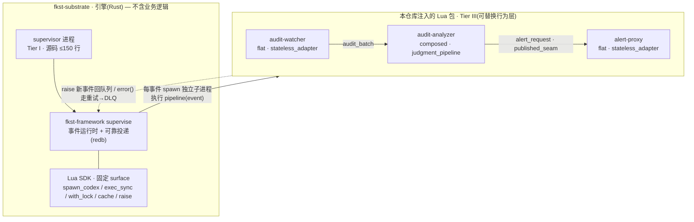
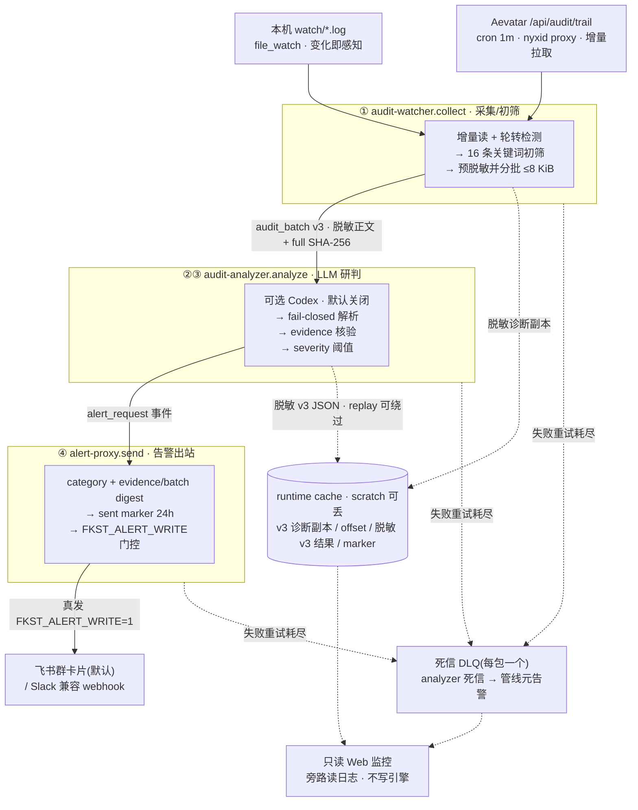
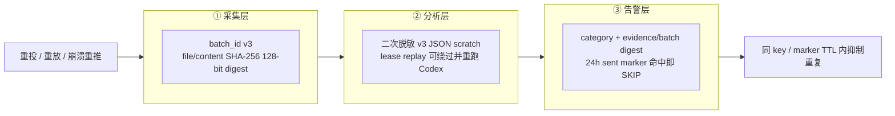
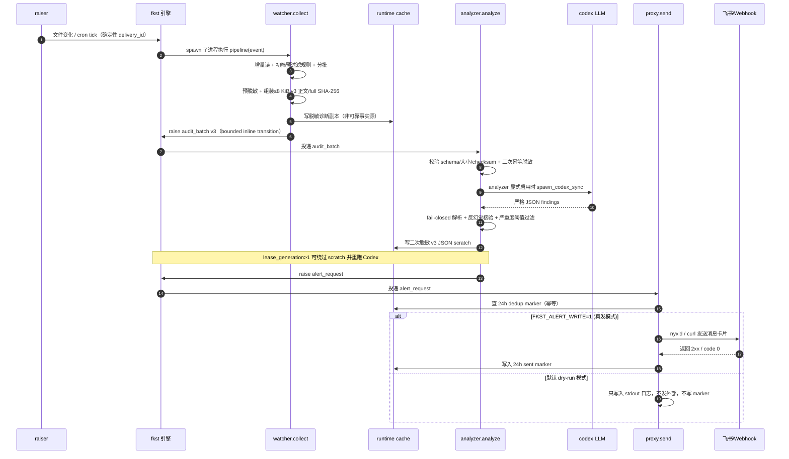

# fkst-audit-log 设计与汇报文档

> 主题：一条"审计日志 → LLM 分析 → 异常告警"的自动监控管线，如何**融合 fkst 运行时**、如何**借鉴开源安全生态**、以及**能达到什么目标**。
> 生成日期：2026-07-09。配套技术底稿：[fkst-工作流程分析报告.md](fkst-工作流程分析报告.md)、[audit-log-llm-监控告警方案.md](audit-log-llm-监控告警方案.md)。
> 本文**业务层**技术论断均可回溯到本仓库源码（给出 `文件:行` 引用）；涉及 fkst 引擎内部的论断（子进程 permit 池、资源类枚举、file_watch 轮询周期等）以配套的[工作流程分析报告](fkst-工作流程分析报告.md)为准，不在本仓库源码内。

---

## 摘要（一页纸结论）

我们用 **fkst**（一个受监督的事件驱动运行时）搭了一条完整的审计日志安全监控管线：**监听审计日志 → LLM 语义分析 → 反幻觉核验 → 有界去重告警**。它同时覆盖两类数据源——本机 `watch/*.log` 文件与 **Aevatar `/api/audit/trail`** 云端审计流（经 NyxID 代理），产出投递到**飞书群**或 Slack 兼容 webhook。

三个核心问题的答案：

1. **如何融合 fkst**：把管线四环节映射成 3 个 fkst 包（[audit-watcher](packages/audit-watcher/) / [audit-analyzer](packages/audit-analyzer/) / [alert-proxy](packages/alert-proxy/)），完整复用引擎的**可靠投递、崩溃即重启、并发限流的 LLM 子进程、死信队列、conformance 门禁、dry-run 姿态**，并逐条照抄 fkst 官方包（`archaudit`、`github-proxy`）验证过的设计模式。我们没有绕过引擎的任何安全边界，而是站在它的能力面上。
2. **如何借鉴开源安全项目**：先做了 **43 个开源项目的联网调研**，得出"通行做法是分层降噪、结构化输出、送云前脱敏、告警去重"的共识，然后把这些共识**落到 fkst 的工程骨架上**——用严格 JSON schema + fail-closed 解析（对标 LogSentinelAI 的 Pydantic Schema）、本地日志关键词与 Aevatar outcome/action 双轨初筛（对标 Wazuh 规则 / Drain3 聚类）、反幻觉证据核验、内容派生去重。fkst 提供的正是这些项目普遍薄弱的部分：可靠投递、幂等、DLQ、dry-run。
3. **能达到什么目标**：一套**崩溃可恢复、幂等去重、上线前可空跑验证**的安全监控**工程骨架**。降噪与误报控制的**机制**（双轨初筛、反幻觉核验、severity 阈值、内容派生去重）已实现并单测覆盖；但**检出率与误报率尚未实测**——因为产生安全判断的 LLM 环节还没在真实模型上跑过真实日志。

**当前状态（务必分清两件事）：**
- **工程底盘：已建成并验证** —— 3 个包 + **93 个 Lua 测试全绿**（本机 `scripts/run.sh test` 实跑输出 `93 passed, 0 failed`）+ 4 个 Web 风险分类测试 + conformance 通过 + 告警投递/去重路径单测覆盖并对本地端手动冒烟；配套只读 Web 监控界面与一键启动脚本。
- **检出价值：已设计、待验证** —— 本机未装 `codex` CLI，**LLM 分析这一最关键环节目前以 mock 覆盖，尚未在真机端到端跑通**。接入 host 的 codex 或本地模型（Ollama/vLLM）后，需用历史日志实测检出率与误报率，才能对"抓得准不准"下结论。这不是一个边角缺口，而是决定工具价值的核心环节——本文后续所有"成效"都据此区分"机制就绪"与"效果已证"。

---

## 一、背景与目标

### 1.1 问题

审计日志（Linux auditd、sudo/PAM、Aevatar 平台审计流、K8s/云审计……）是安全事件的第一现场，但有三个老大难：

- **量大**：绝大多数是正常操作，人工盯不过来；
- **规则死板**：纯规则引擎（如传统 SIEM 规则）对"语义可疑但没命中特征"的事件视而不见；
- **纯 LLM 又太贵、太飘**：把每条日志喂给 LLM，成本和误报都受不了，而且 LLM 会**幻觉**出日志里根本没有的"事件"。

### 1.2 需求拆解：四个环节

```text
① 采集      监听/读取审计日志（本机文件、云审计 trail……）
② LLM 分析  把（初筛后的）可疑片段交给 LLM 做语义理解
③ 异常判定  从 LLM 输出得出"是否异常、多严重"的结构化结论
④ 告警      去重、限流后推送到 IM / webhook，失败要重试
```

四条**隐含工程要求**——正是它们把"能跑的 demo"和"能上生产的系统"区分开：

| 要求 | 含义 |
|---|---|
| **at-least-once 且幂等** | 日志不能漏，也不能重复轰炸 |
| **降噪** | 不能每条日志都喂 LLM，成本和误报都受不了 |
| **LLM 输出不可信** | 必须严格校验，杜绝幻觉 |
| **自监控** | 管线自己挂了也得有人知道 |

### 1.3 目标分层

- **MVP 目标（已达成）**：把四环节端到端串起来，本机文件日志可疑行 → LLM 研判 → 达阈值告警，全链路可空跑（dry-run）验证。
- **工程目标（已达成）**：可靠投递、崩溃即重启、幂等去重、死信兜底、conformance 门禁、dry-run 默认、敏感凭据不进代码。
- **战略目标**：成为 **Aevatar 平台的安全监控哨兵**——常驻轮询平台审计流，对越权/异常认证/可疑资源访问实时研判并推送到值班群，且这套骨架可平移到任意审计日志源。

---

## 二、如何融合 fkst

### 2.1 fkst 是什么（融合的前提）

fkst 是一个**受监督的事件驱动运行时**：Rust 引擎调度 Lua 编写的"部门"（department），部门消费事件队列里的事件，可以在处理中拉起 `codex` CLI（LLM agent）子进程做判断性工作，再把结果作为新事件抛回队列。它的三个特质决定了它特别适合这条管线：

1. **可靠投递 + 崩溃即重启**：可靠性由 redb 投递账本承担，内存队列是瞬时的；崩溃等价于"从零重来"，靠确定性 delivery_id 折叠重复。安全监控恰恰不能因为进程崩了就漏事件。
2. **判断交给 LLM，权力留给确定性代码**：`spawn_codex_sync` 把 LLM 调用做成一等原语，自带并发 permit 池、超时 SIGKILL、审计留痕、错误归类（引擎层能力，详见[工作流程分析报告 §5](fkst-工作流程分析报告.md)）。
3. **强边界**：引擎能触达的外部资源被静态枚举为 `codex/shell/argv/git/filesystem/wall-clock`——**不存在 network 资源类**（同上，引擎层）。任何出站（调 LLM API、发告警）都必须以受审计的子进程形式发生。这对一个安全工具是恰到好处的自我约束——当然也有代价（见 §5.5 的权衡取舍）。

### 2.2 融合点一：把管线四环节映射成 fkst 包族

我们完全照搬 fkst 官方包库的**分层纪律**，用 3 个包对应四环节：

| 包 | 类型 | persistence_class | 对应环节 | 关键 spec |
|---|---|---|---|---|
| [`audit-watcher`](packages/audit-watcher/fkst.toml) | flat | `stateless_adapter` | ① 采集 + 初筛 + 分批 | consumes `audit_file_changed`/`audit_sweep_tick`/`aevatar_audit_poll_tick`，produces `audit_batch`（[collect/main.lua:5](packages/audit-watcher/departments/collect/main.lua)） |
| [`audit-analyzer`](packages/audit-analyzer/fkst.toml) | composed | `judgment_pipeline` | ②③ LLM 分析 + 判定 | `event_deps = [audit-watcher, alert-proxy]`；consumes `audit-watcher.audit_batch`，produces `alert-proxy.alert_request`（[analyze/main.lua:5](packages/audit-analyzer/departments/analyze/main.lua)） |
| [`alert-proxy`](packages/alert-proxy/fkst.toml) | flat | `stateless_adapter` | ④ 告警出站边界 | consumes `alert_request`，`published_seam = {alert_request}` 授权兄弟包投递（[send/main.lua:5](packages/alert-proxy/departments/send/main.lua)） |

跨包生产的授权用的正是 fkst 的机制：**`published_seam` 由消费方（alert-proxy）声明**，analyzer 才能把 `alert_request` 投进来（[send/main.lua:8-10](packages/alert-proxy/departments/send/main.lua)）——这与官方 `github-proxy` 暴露请求队列的模式一模一样。每个包还各带一个 `dead_letter` 部门做死信兜底。

下图是这套映射如何嵌进 fkst：**引擎只管调度与可靠投递，业务判断全在注入的 Lua 包里，包之间只经事件队列通信**（禁止跨包 `require`）：



### 2.3 融合点二：用到了哪些引擎能力 / SDK 原语

我们没有发明任何新能力，全部站在引擎既有的固定 surface 上：

| fkst 原语 / 能力 | 我们怎么用 | 位置 |
|---|---|---|
| **`file_watch` raiser** | 监听 `watch/*.log`，文件 (长度,mtime) 变化即感知（引擎 notify+轮询双通道），启动全量扫描做崩溃恢复 | [raisers/log_watch.lua](packages/audit-watcher/raisers/log_watch.lua) |
| **`cron` raiser** | 10m sweep 兜底扫描 + 活性心跳；1m 触发 Aevatar 轮询 | [sweep_poll.lua](packages/audit-watcher/raisers/sweep_poll.lua)、[aevatar_audit_poll.lua](packages/audit-watcher/raisers/aevatar_audit_poll.lua) |
| **`spawn_codex_sync`** | 可选 LLM 告警支路（默认关闭）：严格 prompt + 10min 超时；引擎会原样记录 stdout | [analyze/main.lua](packages/audit-analyzer/departments/analyze/main.lua) |
| **`exec_sync` + curl / nyxid** | 引擎无 HTTP 原语，出站只能走子进程：拉 Aevatar trail、发 webhook、发飞书卡片 | [collect/main.lua:147](packages/audit-watcher/departments/collect/main.lua)、[send/main.lua:44-82](packages/alert-proxy/departments/send/main.lua) |
| **`with_lock`** | 每文件/每 dedup_key 串行化，杜绝并发重复读与重复发 | [collect/main.lua:275](packages/audit-watcher/departments/collect/main.lua)、[send/main.lua:103](packages/alert-proxy/departments/send/main.lua) |
| **`cache_set/get`（best-effort KV）** | offset / SHA-256 指纹 / v3 诊断副本 / 二次脱敏 analyzer v3 JSON / marker 等均为 scratch；`lease_generation>1` 的可靠 replay 会绕过既有 cache 读取 | 三个包遍布 |
| **`file.read` + 容错回退** | UTF-8 读失败时降级到 `cat` 外读，坏字节 lossy 替换，不污染下游 prompt | [collect/main.lua:27-46](packages/audit-watcher/departments/collect/main.lua) |
| **`json.decode`（无 encode）** | 解析 Aevatar/LLM 输出；**出站 JSON 只能手工拼**，故自写 `json_escape` | [core.lua:87](packages/alert-proxy/core.lua) |
| **`raise(queue, payload)`** | 当前 `audit_batch.v3` 以内联≤8 KiB 预脱敏正文 + full SHA-256 做 bounded transition；长期应改为 `source_ref` 回读 explicit host fact | [collect/main.lua](packages/audit-watcher/departments/collect/main.lua) |
| **可靠投递 + retry/DLQ** | 每部门声明 `retry` 与 `stall_window`；失败 `error()` 走指数退避重投，耗尽进死信 | 各 `main.lua` 的 `M.spec` |
| **`error()` 表达"等会再试"** | 读滞后 / codex 超时 / webhook 失败都抛带 error-class 前缀的错误，借引擎退避重投 | 遍布 |
| **conformance 不可覆盖 gate** | `scripts/run.sh conformance` 校验 runtime-layout / persistence-class / graph-scan / schema-validation | 见 [README.md](README.md) 运维段 |

### 2.4 融合点三：逐条照抄 fkst 验证过的设计模式

fkst 官方包库沉淀了 10 条"搭自己系统时可直接照抄"的模式（见[分析报告 §8](fkst-工作流程分析报告.md)）。我们几乎全部落地：

| fkst 设计模式 | 本仓库的落地 |
|---|---|
| **外部系统即数据库**（包内无持久业务态） | 原始文件/Aevatar 是采集事实源；offset、analyzer 结果、marker 与 v3 诊断副本都是 scratch。inline 正文只随 pending delivery 重投，ack 后不形成业务事实，模型决定也未写 explicit fact |
| **一个 proxy 包做全部 I/O 边界** | `alert-proxy` 是唯一出站告警的地方，dry-run 默认 + marker 幂等 + severity 分级路由（[send/main.lua](packages/alert-proxy/departments/send/main.lua)），姿态完全仿 `github-proxy` |
| **bounded inline 过渡** | 主路径 `batch.v3` 携带预脱敏正文与 full SHA-256；v2 仅 inline 兼容（DJB2/SHA），v1 仅 cache 兼容且 miss 报错。官方长期契约仍是小 payload + `source_ref` + explicit host filesystem fact |
| **LLM 输出 fail-closed 解析** | `parse_findings` 拒绝一切非严格密集 JSON 数组、逐字段限长、未知 severity、超上限条数一律 `error()`（[core.lua:88-131](packages/audit-analyzer/core.lua)） |
| **用 `error()` 表达退避重试** | codex 超时（exit 124）归类 `codex-timeout`、非零归类 `codex-nonzero`，走引擎 retry（[analyze/main.lua:44-50](packages/audit-analyzer/departments/analyze/main.lua)） |
| **一切可 SIGKILL** | 无优雅关停；恢复 = file_watch 启动全量扫描 + redb 重推 + 确定性 delivery_id 折叠（[collect/main.lua:302-306](packages/audit-watcher/departments/collect/main.lua)） |
| **预算处处有界** | 批正文 ≤8 KiB、单行 ≤2 KiB、每轮最多 5 个 finding、Aevatar 每 tick 页数/条数有硬上限、retry 有上限——没有无界循环（[audit-watcher/core.lua](packages/audit-watcher/core.lua)、[audit-analyzer/core.lua](packages/audit-analyzer/core.lua)） |
| **双网兜底**（错误侧 + 活性侧） | 错误侧：retry→DLQ→analyzer 死信升级为管线元告警；活性侧：cron sweep 心跳 + `fkst.observe()` DLQ 巡检 |

### 2.5 融合点四：直接对标的两个样板包

- **`archaudit`（同构样板）**：官方的"定时/条件触发 → LLM 分析 → 结构化产出 → 对外告警"完整实现。我们的 analyzer 整段沿用它的三件套——**严格 prompt + fail-closed 解析 + 反幻觉核验**（archaudit 用 `git show HEAD:<file>` 验证 file:line 存在，我们用 `evidence_line` 必须逐字出现在被分析批次里，[core.lua:135-137](packages/audit-analyzer/core.lua)）。
- **`github-proxy`（姿态纪律）**：唯一碰 GitHub API 的 proxy 包。我们的 alert-proxy 继承它的**四条姿态纪律**——dry-run 默认（`FKST_ALERT_WRITE=1` 是唯一真发开关，对标 `FKST_GITHUB_WRITE=1`）、写边界 marker 幂等、投递失败一律抛 retryable `error()` 走引擎退避重投（限流靠主机级 `FKST_RATE_POOL_CURL` 令牌桶）、severity 分级路由（[send/main.lua:109-131](packages/alert-proxy/departments/send/main.lua)）。

### 2.6 引擎"刻意不给"的能力，与我们的合规绕行

fkst 刻意不提供某些能力（这是它的安全哲学），我们没有破坏边界，而是用引擎认可的方式绕行：

| 引擎不给 | 原因 | 我们的合规做法 |
|---|---|---|
| **HTTP / 网络原语** | 网络 egress 只能以受审计子进程发生 | `exec_sync` + `curl`（webhook）/ `nyxid proxy request`（Aevatar 拉取、飞书投递） |
| **通知 / webhook 原语** | "人类通知用既有 git/fs/log 事实表达" | 告警作为 `exec_sync` 出站，全程留 `EVENT=external_command` 审计日志 |
| **`json.encode`** | 强制显式构造，防止误序列化敏感字段 | 手写 `json_escape` + 拼 JSON，控制字符替换成空格保证合法（[core.lua:87-109](packages/alert-proxy/core.lua)） |

> **一句话**：这条管线不是"用 fkst 写了点脚本"，而是**把 fkst 的可靠性模型、边界模型、姿态纪律整体继承下来**，管线代码只负责"判断日志可疑不可疑"这一件业务事，其余全交给引擎。

---

## 三、如何借鉴开源安全项目

### 3.1 调研规模与方法

在动手前做了一轮系统性开源调研（详见 [audit-log-llm-监控告警方案.md](audit-log-llm-监控告警方案.md)）：**43 个候选项目全部联网核验**（仓库真实性、许可证、活跃度、管线覆盖度），分四类：端到端完整方案、平台级部分覆盖、SOAR/AI-SOC 编排层、研究/积木级。

**核心结论**：这个方向已经很热闹，但**没有一个项目是"用事件驱动 agent 运行时编排"的 fkst 形态**；不过每个环节都有成熟的做法可以借鉴。于是我们的策略是——**抄思想，不抄栈**：把开源生态的共识做法，落到 fkst 的工程骨架上。

### 3.2 借鉴映射表（本章核心）

落地状态图例：✅ 已落地并单测覆盖 · 🚧 部分落地 · 📋 路线图（尚未落地）。

| 开源来源 | 借鉴的思想 | 本仓库的落地状态与位置 |
|---|---|---|
| **LogSentinelAI**（MIT，LLM 安全日志分析器，与需求几乎逐字吻合） | 用**声明式 Schema 约束 LLM 直接输出结构化 JSON**，零正则 | ✅ 严格 JSON schema + `parse_findings` fail-closed 解析（[audit-analyzer/core.lua:60-131](packages/audit-analyzer/core.lua)）；prompt 显式声明 object schema（[core.lua:70-72](packages/audit-analyzer/core.lua)） |
| **Wazuh 规则式初筛**（+ Falco / Drain3 聚类 / RCF 是同族的更强做法） | 全行业都**先用规则/ML/模板筛，再让 LLM 只研判可疑片段**——"LLM 直读原始日志"是所有项目共同回避的做法（太贵、误报高） | ✅ 双轨初筛第一道闸：本地日志仍用 16 条子串 pattern；Aevatar 按 outcome + action 分类，覆盖失败事实和成功的高影响治理变更，同时跳过普通成功与 `*.attempted`（[audit-watcher/core.lua](packages/audit-watcher/core.lua)）。<br>📋 Drain3 模板聚类 / RCF 等更强初筛仍是路线图（见 §5.3） |
| **K8sGPT 匿名化 / SOCFortress PII 代理 / Wazuh-MCP 输出脱敏** —— **审计日志含敏感信息，上云 LLM 前要处理** | 送云前脱敏，或干脆用本地模型 | ✅ watcher 发布前脱敏，身份只留 8-byte 前缀；Aevatar `source_path` 的 scope 同样截断且整体≤512 bytes。v3 payload/诊断 cache 与 analyzer v3 cache 只含脱敏文本。⚠️ 引擎仍原样记录 Codex stdout，启用必须有 OS/container 可读面隔离 |
| **consensus 多角度共识 / 一票否决**（fkst 侧）+ 各 AI-SOC 的多 agent 研判 | 单次 LLM 判断不可全信，高危项需多角度复核 | 📋 多角度共识 / 一票否决**尚未实现**。<br>✅ 当前只有更轻的一层——**archaudit 式反幻觉核验**（不是多角度复核）：`evidence_line` 必须逐字等于实际脱敏分析文本中的完整一行，否则丢弃（[analyze/main.lua](packages/audit-analyzer/departments/analyze/main.lua)，同 §2.5） |
| **Keep（开源告警中枢）/ HolmesGPT / Robusta** —— 去重、关联、AI 摘要、多渠道路由 | 告警末端要做**去重网关** | ✅ dedup key = category + evidence SHA-256 128-bit digest + batch_id SHA-256 128-bit digest，不含天桶；成功发送后 sent marker TTL 24h |
| **Falco/Wazuh 前置 + falco-gpt / Wazuh-LLM-PoC** 的形态 | 日志量大时，让专业工具做采集+规则初筛，fkst 只研判"已是告警"的事件 | 📋 **方案 B（未实现，仅设计）**：把 Wazuh/Falco 输出的告警目录交给 `file_watch`，LLM prompt 从"找异常"简化为"研判真假 + 处置建议"（[调研方案 §3.2.3](audit-log-llm-监控告警方案.md)）。`packages/` 中无此集成 |
| **severity 分级 / 结构化输出 / 告警去重**（全行业共识） | 这是所有成熟项目的标配 | ✅ severity 阈值路由（`AUDIT_ALERT_MIN_SEVERITY` 默认 high，[analyze/main.lua:26-33](packages/audit-analyzer/departments/analyze/main.lua)）+ 结构化输出 + 去重。<br>⚠️ critical 专用 webhook 通道**仅 `webhook` 模式生效**（[send/main.lua:30-38](packages/alert-proxy/departments/send/main.lua)）；默认 `lark` 模式下 critical 只是卡片配色升级（[core.lua:111-119](packages/alert-proxy/core.lua)），无独立通道 |

### 3.3 我们相对这些项目的差异化（诚实界定对比对象）

先说清楚，避免稻草人：**不是所有开源项目都薄弱**。平台级工具（Wazuh、Keep、Matano、ElastAlert 2）本身就有成熟的重试/去重/持久化。我们真正超越的是 **"LLM 胶水脚本"这一类**——即 falco-gpt、各类 Wazuh-LLM-PoC 那种"把日志/告警塞给 LLM、再发个通知"的最小实现。相对它们，fkst 骨架补上的正是工程可靠性：

| 维度 | LLM 胶水脚本类（falco-gpt / 各 LLM PoC） | 本仓库（fkst 骨架） |
|---|---|---|
| 投递可靠性 | 多为内存队列 / 无重试 | at-least-once-until-ack + redb 账本 + 指数退避 |
| 重复抑制 | 常缺失，重复告警 | 确定性 batch identity + 可绕过的模型 scratch + batch-scoped dedup/sent marker |
| 死信 | 无 | 每包 DLQ，analyzer 死信升级为元告警 |
| 上线前验证 | 一上来就真发 | dry-run 默认，可全链路空跑一周再开真发开关 |
| 崩溃恢复 | 需人工重启补数 | SIGKILL 即恢复，启动全量扫描重推 |
| 变更安全 | 无门禁 | conformance 不可覆盖 gate + 93 个 Lua 测试 |

> **一句话**：我们没有重复造轮子去做"LLM 分析器"（那是 LogSentinelAI 们的强项），也不宣称比 Wazuh 这类平台更可靠；真正的差异化是把 **LLM 语义研判装进 fkst 这套受监督运行时**——"判断能力 + 工程可靠性"的组合，这是胶水脚本类给不了的。

---

## 四、系统架构与实现

### 4.1 架构总览

下图是系统全景：两个数据源汇入采集包，经初筛、预脱敏和分批后，以 **bounded inline v3 delivery** 驱动可选 LLM 研判，再经去重与 dry-run 门控出站。analyzer 默认关闭且不参与确定性的 stability → issue → devloop 主路径。**实线是事件流，虚线是 scratch / 死信 / 只读监控等旁路**。



> 图为 Mermaid（GitHub / VS Code / Typora 等可直接渲染）。三条纵向主干正好对应 §1.2 的四环节：采集 → LLM 研判(含判定) → 告警。

### 4.2 双数据源与初筛机制

#### 4.2.1 数据来源及采集时机
- **源 A（本机文件日志）**：
  - 监听路径默认为 `watch/*.log`（可在 [log_watch.lua](file:///Users/eanzhao/Code/fkst-audit-log/packages/audit-watcher/raisers/log_watch.lua) 中改为系统路径，例如 `/var/log/audit/*.log`）。
  - **触发时机**：由 file_watch raiser 实时监听文件大小与修改时间变化（5s 内感知），并在引擎事件机制中抛出 `audit_file_changed` 事件触发采集；另有每 10 分钟一次的 cron raiser（[sweep_poll.lua](file:///Users/eanzhao/Code/fkst-audit-log/packages/audit-watcher/raisers/sweep_poll.lua)）进行全量扫描做可靠性兜底。
  - **读取方式**：`audit-watcher.collect` 收到事件后，使用串行锁读取文件增量，比对 cache 中的 offset 与 `v2:<size>:<完整 SHA-256>` 内容指纹。版本、长度或 64-hex digest 不符即按轮转从头重读；file/batch runtime identity 使用 SHA-256 的 128-bit 前缀。
- **源 B（Aevatar 云审计日志流）**：
  - 请求端点为 Aevatar 平台的 `/api/audit/trail`（当前默认监控 Aevatar pro 端点 `https://aevatar-console-backend-api.aevatar.ai`）。
  - **触发时机**：由每分钟执行一次的 cron raiser（[aevatar_audit_poll.lua](file:///Users/eanzhao/Code/fkst-audit-log/packages/aevatar_audit_poll.lua)）产生 `aevatar_audit_poll_tick` 触发轮询。
  - **读取方式**：在 [collect/main.lua](file:///Users/eanzhao/Code/fkst-audit-log/packages/audit-watcher/departments/collect/main.lua) 中，通过 NyxID 拉取固定 newest-first `from/to` 窗口并跨 tick 续 cursor。完整 scope 仅参与查询身份，进入 durable/display `source_path` 时截为 8-byte 身份前缀，且整个路径上限 512 bytes；audit id 另以 seen-id cache 去重（7 天 TTL）。

#### 4.2.2 第一道闸：采集端预过滤与投喂时机
为了控制 LLM 调用成本及误报率，系统绝不采用“原始日志直读”方案，而是在采集端对日志行和审计记录执行严格的**首轮预过滤初筛**：
1. **本地日志初筛规则**（[core.lua:is_suspicious](file:///Users/eanzhao/Code/fkst-audit-log/packages/audit-watcher/core.lua#L194-L202)）：
   - 将日志行转为小写，使用 16 条子串/正则 Pattern 进行匹配筛查。
   - 过滤关键词包括：`denied`、`failure`、`failed`、`invalid`、`unauthorized`、`refused`、`privilege`、`sudo`、`su[`、`useradd`、`usermod`、`passwd`、`segfault`、`audit`、`anomal`、`error`。
2. **Aevatar 记录初筛规则**（[core.lua:is_suspicious_aevatar_record](file:///Users/eanzhao/Code/fkst-audit-log/packages/audit-watcher/core.lua#L344-L384)）：
   - **结果判定**：如果 Outcome 缺失或不属于正常范围（非 `accepted` / `success` / `succeeded`），则直接判定为可疑。
   - **行为判定**：即使 Outcome 为 Success，若 Action 以 `.failed` / `.rejected` / `.denied` / `.error` / `.cancelled` 结尾（说明虽然审计事实写入成功，但实际业务操作失败），同样判定可疑。
   - **高影响动作 review 候选**：针对成功的高影响治理操作（例如 policy、permission、credential、secret 变更，以及 identity/service 绑定、deployment 激活、发布等名下带有删除、撤销、下线等语义的操作），一律判定可疑送检。同时，过滤掉仅仅代表开始尝试的 `*.attempted` 动作，避免同一请求重复分析。

**投喂时机**：通过初筛的记录按≤8 KiB 拼批。watcher 先脱敏/重截断，再发布 `audit-watcher.batch.v3`：payload 带 `content_schema="audit-redaction.v1"`、脱敏 `content`、完整 64-hex SHA-256 `content_checksum` 和≤512-byte `source_path`。batch 内部修订同为 v3，file/content key 段使用 SHA-256 128-bit 前缀。v2 仅作 inline 滚动兼容（接受旧十进制 DJB2 或 SHA-256），v1 仅作 cache 兼容且 miss fail-visible。

≤8 KiB inline 正文是当前引擎 64 KiB 上限内的**bounded transition/隐私取舍**：pending delivery 可独立重试且无需落原始敏感 fact，但 ack 后它不是业务事实。官方长期方向是把预脱敏正文原子发布为 explicit host filesystem fact，事件只带 `source_ref`、digest、schema 和小控制字段，消费时回源校验。

### 4.3 可靠性与幂等（三层去重）

投递语义是 **at-least-once-until-ack**，下列三层负责身份、成本优化和外发抑制；不构成模型 exactly-once：

1. **采集层**：`batch_id = v3 + file_key + offsets + chunk_index + content_digest`；file/content digest 均为 SHA-256 128-bit 前缀，payload 完整性使用 full SHA-256。
2. **分析层**：通过 evidence 门禁的 finding 会再次脱敏，并以 `redacted-v3-sanitized-output` JSON 写入 24h scratch cache。它不是确定性事实；可靠重投在 `lease_generation>1` 时绕过既有 cache，可重新调用 Codex并得到不同输出。
3. **告警层**：`dedup_key = category + evidence_digest + batch_digest`（两个 digest 均为 SHA-256 128-bit 前缀，无天桶）。成功发送后写 24h sent marker，同 key 在 TTL 内命中即跳过。

这些层尽力折叠重复，但不是 exactly-once；模型结果未落 explicit fact，可靠 replay 也可重算。最终抑制边界是同一 dedup key 且 sent marker 仍在 24h TTL 内：



**崩溃恢复**：直接 kill 再拉起。file_watch 启动全量扫描 + redb 在途账本重推一切；offset 缓存丢失只导致重复分析，被上述幂等层吸收。

### 4.4 安全边界（一个安全工具对自己的约束）

- **dry-run 默认**：`FKST_ALERT_WRITE=1` 是唯一真发开关，未设置只打 `OUTBOUND mode=dry-run` 日志且**不写 sent marker**（保证之后开开关仍会补发）（[send/main.lua:112-117](packages/alert-proxy/departments/send/main.lua)）。
- **输入与输出双重 fail-closed**：v3 输入必须通过 `content_schema`、非空正文、8 KiB 上限与 full SHA-256 校验；v2/v1 仅滚动兼容。LLM 输出先过严格 JSON/字段/evidence 门禁，通过后再二次脱敏并写 v3 scratch JSON。
- **Codex 日志边界**：`spawn_codex_sync` 原样记录 stdout，repo 内不能关闭；`read-only` 仍可读取宿主可见文件。启用 analyzer 前必须通过 OS/container 收窄可读面。
- **模型决定不是 critical fact**：accepted finding 没有持久化为 explicit host fact，cache 在 replay 时可绕过；可选 analyzer 默认关闭，不参与确定性的 stability → issue → devloop 主路径。
- **凭据零泄漏**：webhook URL / NyxID service / Lark chat_id 全走 host env，不进代码；`exec_sync` 用 `env=` 传值而非拼进命令行（[send/main.lua:44-51](packages/alert-proxy/departments/send/main.lua)）；Web 界面对敏感项只显脱敏摘要。
- **出站全留痕**：每次 `exec_sync` 都写 `EVENT=external_command` 审计日志。

### 4.5 自监控（管线挂了谁报警）

- **cron sweep 心跳**（10m）：兜底扫描注册过的文件，同时是活性证明。
- **analyzer 死信升级**：analyzer 持续失败（如本机缺 codex）时，其死信部门把失败升级为一条 `alert-proxy.alert_request` 元告警（category=`pipeline-dead-letter`，severity high）；Web 界面另会据此合成一条 `pipeline_health` 发现，直接暴露"管线本身不健康"。
- **`fkst.observe()`**：读引擎投递账本，DLQ 非空 / 队列积压可查。

### 4.6 只读 Web 监控界面

`web/`（Vite + React + Express adapter）是一个**只读**监控网站：旁路 scrape `.fkst/run` runtime 日志、`watch/*.log`、进程 env，把管线状态渲染成五个视图（管线状态 / 审计事件 / 批次·发现 / 告警 / 配置）。它**不写任何东西、不碰引擎**，敏感项脱敏，示例数据仅在显式开启且数据集为空时注入并打 `sample` 标记。`./boot.sh` 一条命令同时起 引擎 + adapter(:5174) + UI(:5173)。

### 4.7 测试与验证现状

- **93 个 Lua 测试全绿**：本机 `scripts/run.sh test` 实跑输出 `93 passed, 0 failed`；覆盖增量读取 / 文件轮转 / 双轨初筛 / fail-closed 解析 / 反幻觉核验 / dedup / dry-run 门控 / Aevatar 分页去重（fixtures 见 [tests/fixtures](packages/audit-watcher/tests/fixtures/)）。
- **4 个 Web 风险分类测试全绿 + production build 通过**：覆盖正常 outcome、失败事实、高影响成功变更和 attempt 去重语义。
- **conformance 通过**：不可覆盖 gate 全绿。
- **告警投递/去重：单测覆盖 + 手动冒烟**：`send_test.lua` 覆盖 dry-run 门控与 dedup 抑制；真发路径（`FKST_ALERT_WRITE=1`）已对本地 HTTP 端手动冒烟（见项目记录，无自动化回归 artifact）。
- **核心缺口（不是边角）**：本机无 `codex` CLI，**产生安全判断的 LLM 环节以 mock 覆盖，从未真机端到端跑通**；接入真实 codex 或本地模型后才能测检出率/误报率。

---

### 4.8 LLM 研判、异常判定与告警投递细则

#### 4.8.1 LLM 启动与提示词模板
`audit-analyzer` 接收 `audit_batch` 后先校验/脱敏；仅在 `AUDIT_ANALYZER_CODEX_ENABLED=1` 时才调用 `spawn_codex_sync`。该支路默认关闭，确定性的 stability → issue → devloop 不依赖它：
```lua
  local analysis_lines = core.redact_log_lines(batch_lines)
  local result = spawn_codex_sync({
    prompt = core.build_prompt(analysis_lines, core.max_findings()),
    sandbox = "read-only",
    timeout = codex_timeout_seconds, -- 默认 10 分钟超时
  })
```
引擎会把 `spawn_codex_sync` stdout 原样写入 Codex process-trace log，repo 内不能关闭；结果 cache 只保存通过 evidence 门禁后再次脱敏的 `redacted-v3-sanitized-output` JSON。cache 是 scratch，`lease_generation>1` replay 可绕过并重跑 Codex，因此模型判断不是 explicit fact 或端到端 critical reliable path。

启动大模型时，通过 [core.lua:build_prompt](packages/audit-analyzer/core.lua#L60-L89) 构建并注入如下系统提示词：
```text
You are a security analyst reviewing pre-filtered audit log lines.
Analyze ONLY the log lines between the LOG LINES markers below.
Input can contain host logs or structured lines beginning with 'aevatar event'.
Identify genuine anomalies: privilege escalation, brute-force or unusual
authentication failures, suspicious process or file access, persistence
attempts, data exfiltration, failed/rejected platform operations, or an
unusual sequence of high-impact governance changes (policy, identity/service
binding, credentials/keys, deletion/revocation, deployment, or publishing).
For Aevatar projection facts, outcome=Success means the audit artifact was
materialized successfully; an action ending in .failed or .rejected still
describes a failed domain operation and must be interpreted from its action.
A single successful high-impact mutation is not anomalous by itself. Report it
only when the supplied lines contain concrete evidence of unexpected behavior,
dangerous blast radius, repetition, or a failure/denial; never assume that the
hashed actor was unauthorized from the action name alone.
Do not invent events that are not present in the lines.
Do not report routine, benign operations.
Return strict JSON only: an array of at most <limit> objects, no prose.
Object schema: {"severity":"critical|high|medium|low","category":"short-slug",
  "evidence_line":"<one exact line copied verbatim from the input>",
  "why":"...","recommended_action":"..."}
Return [] when nothing is anomalous.

=== LOG LINES START ===
<log_lines>
=== LOG LINES END ===
```

#### 4.8.2 异常判定与反幻觉核验
1. **严格 fail-closed 解析**：LLM 的输出结果被传入 [core.lua:parse_findings](packages/audit-analyzer/core.lua#L98-L141)。解析器要求输出必须是合法的密集 JSON 数组、每个 Finding 中的字段均在限长范围之内、带有已知的 Severity 级别，且 Finding 总数不得超过上限（5 个）。若有任一条件不满足，直接抛出 `error()` 并 fail-closed，将当前事件打入 retry 逻辑或 Dead Letter 队列。
2. **反幻觉门禁**（[core.lua:evidence_present](packages/audit-analyzer/core.lua)）：验证模型原始 Finding 中的 `evidence_line` 是否等于实际脱敏分析文本中的完整一行；通过后才对 finding 再脱敏。若不匹配则丢弃。
3. **严重度阈值过滤**：读取 `AUDIT_ALERT_MIN_SEVERITY`（默认 `high`）并转换为数字 Rank。只有 Severity 等于或高于该 Rank 值的 Finding，才会引发告警投递请求（发出 `alert-proxy.alert_request` 事件）。

#### 4.8.3 告警投递、去重与重试机制
告警最终由 `alert-proxy` 统一负责外发。其运行逻辑如下：
1. **内容派生去重机制**：
   - `dedup_key` 由 `category + evidence SHA-256 128-bit digest + batch_id SHA-256 128-bit digest` 派生，不含天桶。
   - `alert-proxy` 在串行锁保护下检查 sent marker。同 key 成功发送后 marker 保留 24 小时；TTL 内命中即跳过。
2. **出站门控与 Dry-run 模式**：
   - 检查环境变量 `FKST_ALERT_WRITE`。未设或不等于 `1` 时以 `dry-run` 方式空跑（不向外部发送且**不写 sent marker**，确保一旦开启开关能补发此前告警）；当其设为 `1` 时执行真实发送。
3. **真实投递通道**：
   - **飞书/Lark（默认，`ALERT_DELIVERY_MODE=lark`）**：调用 `nyxid proxy request` 并拼装飞书交互式消息卡片 DTO 抛给目标群组（服务名默认为 `api-lark-bot`，接收 chat 标识由 `ALERT_LARK_CHAT_ID` 提供）。
   - **Webhook 模式（`ALERT_DELIVERY_MODE=webhook`）**：通过 Host 的 `curl` 发送 Slack 兼容格式的 `{"text": "..."}` 消息到 `ALERT_WEBHOOK_URL`；对 `critical` 级告警优先路由至 `ALERT_WEBHOOK_URL_CRITICAL` 独立通道（若设置）。
4. **可靠性重试与死信**：
   - 发送异常抛出 `error()` 让引擎触发 5 次指数退避重试（[send/main.lua:12](packages/alert-proxy/departments/send/main.lua)）。
   - 重试耗尽则流转至 `dead_letter`。其死信处理部门会使用独立的 `ALERT_FALLBACK_WEBHOOK_URL` 备用通道发送紧急元告警。

#### 4.8.4 端到端流程演示与时序图
> 说明：下面的 LLM 响应为**手工构造的期望形态**（本机未接真实模型），用于展示数据在四环节间如何流转、每道闸如何把关。

**① 采集**（audit-watcher.collect）：`watch/audit.log` 追加三行，两行命中初筛关键词（`failed` / `sudo`），第三行未命中被丢弃：
```
type=USER_AUTH msg=audit(1783600000.1:9): res=failed acct="root" exe="/usr/sbin/sshd" addr=203.0.113.9
type=USER_CMD  msg=audit(1783600001.2:10): sudo cmd="/bin/bash" auid=1000 res=success
type=CRED_ACQ  msg=audit(1783600002.3:11): res=success acct="deploy"        ← 未命中，丢弃
```
前两行进批并预脱敏，raise `audit_batch{schema="audit-watcher.batch.v3", batch_id="v3-…-<128-bit SHA>", content_schema="audit-redaction.v1", content=…, content_checksum="<full SHA-256>", source_path="watch/audit.log", dedup_key="audit-batch/…"}`；cache 只保留脱敏诊断副本。

**②③ 分析 + 判定**（audit-analyzer.analyze）：校验 durable payload → 二次幂等脱敏 → `spawn_codex_sync` 得到模型返回的**严格 JSON 数组**：
```json
[{"severity":"high","category":"ssh-bruteforce",
  "evidence_line":"type=USER_AUTH msg=audit(1783600000.1:9): res=failed acct="root" exe="/usr/sbin/sshd" addr=203.0.113.9",
  "why":"针对 root 的外部 SSH 认证失败，疑似暴力破解。",
  "recommended_action":"封禁 203.0.113.9，root 改为仅密钥登录。"}]
```
核验通过（格式/字段合格，证据存在于批次行中，Severity 为 high 符合阈值）→ raise `alert-proxy.alert_request{dedup_key="audit-alert/ssh-bruteforce/<evidence-digest>/<batch-digest>"}`。

**④ 告警**（alert-proxy.send）：核验通过 → `with_lock` 查 marker 未命中 → 判定 `FKST_ALERT_WRITE`。若为 `1`，渲染 Lark 卡片，经 `nyxid` POST 到群聊，并在成功后写入 24 小时 dedup marker。

同一事件在四环节间的完整时序如下：


普通重复可能命中 analyzer scratch；可靠 replay 可能重跑 Codex。若最终仍产生相同 category/evidence/batch digest，alert-proxy 会在 sent marker 的 24h TTL 内 SKIP；这不是模型 exactly-once 保证。


## 五、能达到的目标与成效

### 5.1 已建成与已验证的部分

| 类别 | 成效 |
|---|---|
| **功能** | 双源采集（本机文件 + Aevatar 云审计）→ 初筛 → LLM 研判 → 反幻觉核验 → 分级去重告警（飞书 / webhook）**全链路已串起**；但 LLM 环节本机以 mock 覆盖，**未真机端到端跑通**（见 §5.3） |
| **工程** | 可靠事件投递 + batch identity / sent-marker 抑制 + DLQ + dry-run + conformance；可选模型判断本身不是持久事实 |
| **验证** | 93 个 Lua 测试全绿 + 4 个 Web 测试 + conformance 通过 + 告警投递/去重单测与手动冒烟 + 只读监控界面 |
| **安全** | 凭据零泄漏、出站全留痕、fail-closed、反幻觉——一个安全工具对自身的自律 |

### 5.2 能力矩阵（对照四环节）

| 环节 | 能力 | 降噪 / 成本控制手段 |
|---|---|---|
| ① 采集 | 文件增量读 + 轮转检测 + 云审计增量分页 | 本地 16 条关键词 + Aevatar outcome/action 分类，只有候选事件进 LLM |
| ② 分析 | 可选 LLM 语义研判（默认关闭），严格结构化输出 | 批正文≤8 KiB、每轮≤5 finding；二次脱敏 v3 JSON cache 仅 scratch，replay 可重算 |
| ③ 判定 | severity 阈值 + 反幻觉核验 | 默认只有 high/critical 且证据属实才成告警 |
| ④ 告警 | 飞书群 / webhook，分级路由，失败重试 | category+evidence/batch digest + sent marker 24h + dry-run |

### 5.3 明确的边界与局限

- **依赖 host 的 codex / nyxid**：analyzer 默认关闭；启用需 host `codex` 登录并以 OS/container 收窄可读面，因为引擎会原样记录 stdout且 repo 无关闭开关。Aevatar / 飞书依赖 NyxID。
- **规则初筛仍较粗**：本地 16 条 pattern 可能漏掉"语义可疑但无关键词"的行；Aevatar 查询 DTO 又未暴露 sensitivity/destructive，只能依赖稳定 action 命名——路线图用服务端风险字段、Drain3 聚类或前置规则引擎补强。
- **本机未端到端跑 LLM**：本机无 codex，该环节靠 mock；结论质量需接真实模型后用历史日志调优。
- **LLM 不是 critical fact path**：模型决定未写 explicit host fact，scratch cache 可在 replay 时绕过；确定性 stability → issue → devloop 不依赖 analyzer。
- **inline payload 是过渡**：v3≤8 KiB 预脱敏正文是当前引擎上限内的隐私取舍，长期应迁移到 explicit host filesystem fact + `source_ref`。

### 5.4 路线图

1. **接真实模型**：host codex 或本地 Ollama/vLLM（敏感日志优先本地以减少外发面，但仍保留发布前与 analyzer 的两层脱敏）。
2. **二次复核**：高危 finding 照抄 fkst `consensus` 包的多角度共识、一票否决，进一步压误报。
3. **降噪升级**：Drain3 模板聚类"每类只喂一个代表样本"，或方案 B 前置 Wazuh/Falco 规则引擎。
4. **研判增强**：接 HolmesGPT 自定义 toolset 做告警后的根因研判。
5. **prompt/schema 调优**：对照 LogSentinelAI 的 auditd 分析器 schema 迭代。

---

### 5.5 现状可测边界：哪些数字是真的、哪些待实测

一份负责任的汇报必须把"机制就绪"和"效果已证"分开。下表是当前能给出的真实数字与仍空白的指标：

| 指标 | 现状 | 说明 |
|---|---|---|
| Lua 测试 | **93 passed / 0 failed（实测）** | `scripts/run.sh test` 输出 |
| Web 风险分类 | **4 passed / 0 failed（实测）** | `npm test` 输出 |
| conformance | **通过（实测）** | 不可覆盖 gate |
| 告警投递 / 去重 | 单测 + 手动冒烟 | 无自动化回归 artifact |
| 初筛降噪率 | **未测** | 取决于真实日志分布 |
| LLM 检出率 / 召回 | **未测** | 需真实模型跑含已知攻击样本的真实日志 |
| 误报率（FP） | **未测** | 反幻觉核验能压"幻觉"，压不了"真误判" |
| 单事件 LLM 成本 | **未测** | 批正文≤8 KiB、每轮≤5 finding；scratch cache 可能省调用，可靠 replay 可重跑 Codex |
| 吞吐 / 端到端时延 | **未测** | 需真机负载 |

一句话：**工程底盘的数字是真的；安全效果的数字目前全是空白，要接真实模型后才能填。**

### 5.6 采用 fkst 的权衡取舍（为什么值得、代价是什么）

选 fkst 不是免费的，如实列出：

- **买到了**：可靠投递 / 崩溃即恢复 / DLQ / dry-run 姿态 / conformance 门禁 / 受审计的子进程边界——正是"胶水脚本"类方案缺的，也是安全工具最该有的。
- **付出的代价**：① **硬依赖 host 环境**——LLM 环节要 host 装了 `codex` 且已登录，Aevatar 拉取与飞书投递依赖当前 NyxID 登录账号，任一失效对应环节停摆（但会走 DLQ 并升级元告警，不静默）；② **无原生 HTTP**——出站全靠 shell 到 `curl`/`nyxid`，JSON 手工拼，工程更啰嗦；③ **生态小**——自研运行时，没有现成分析器和社区规则库，多数东西自己写。
- **为什么仍选它**：这条管线的价值不在"又一个 LLM 分析器"，而在"**把 LLM 判断装进一个能可靠重启、不漏事件、能空跑验证的受监督运行时**"。对安全监控，可靠性与可审计性的权重高于生态丰富度——这笔账划得来。

### 5.7 下一步与所需支持（这份汇报想要什么）

要把系统从"工程骨架"推到"可信的安全哨兵"，需要三类决策/资源：

| 需要什么 | 用途 | 类型 |
|---|---|---|
| **一个模型入口**：host 装 `codex` 并登录，或部署本地 Ollama/vLLM | 打通 LLM 环节才能实测检出率/误报率；含敏感日志时优先本地模型并继续保留两层脱敏 | 资源 / 权限 |
| **一份带标注的历史审计日志**（含若干已知攻击样本） | 离线调 prompt/schema、量化检出率与误报率 | 数据 |
| **Aevatar admin scope**（可选） | 若要 `AEVATAR_AUDIT_SCOPE=__all__` 跨 scope 监控 | 授权 |
| **真发开关 sign-off** | dry-run 空跑一周、核对判定质量后，批准置 `FKST_ALERT_WRITE=1` 真发到值班群 | 决策 |

拿到前两项，约可在数天内给出第一版检出率/误报率/成本的真实数字——那才是回答"能达到什么目标"的硬证据。

---

## 附录 A：关键配置项

| 变量 | 默认 | 说明 |
|---|---|---|
| `FKST_ALERT_WRITE` | 未设置（dry-run） | `1` 才真发 |
| `ALERT_DELIVERY_MODE` | `lark` | `lark`（NyxID 飞书 bot）/ `webhook`（Slack 兼容） |
| `AUDIT_ALERT_MIN_SEVERITY` | `high` | 告警阈值 critical/high/medium/low |
| `AEVATAR_AUDIT_ENABLED` | 未设置 | `1` 才轮询 `/api/audit/trail` |
| `AEVATAR_AUDIT_SCOPE` | — | `__all__` 需 Aevatar admin |
| `FKST_RATE_POOL_CURL` | 不限流 | `<burst>,<每分钟补充>` 主机级 curl 限流 |

完整清单见 [README.md](README.md) 配置段。

## 附录 B：主要参考的开源项目

端到端：**LogSentinelAI**（MIT）、**SOCFortress CoPilot**（AGPL）。采集/规则底座：**Wazuh**、**Falco**、**Matano**、**ElastAlert 2**。研判层：**HolmesGPT**、**Robusta**、**K8sGPT**、**Keep**。SOAR：**Tracecat**、**Shuffle**、**Agentic SOC Platform**。积木：**Drain3**、**LogAI**、**OpenSearch Anomaly Detection**。全 43 项目清单与核验结论见 [audit-log-llm-监控告警方案.md](audit-log-llm-监控告警方案.md)。

---

*本文由深读本仓库源码（3 个包 + core/departments/raisers）与两份技术底稿综合生成，技术论断经多智能体对照源码核验。*
